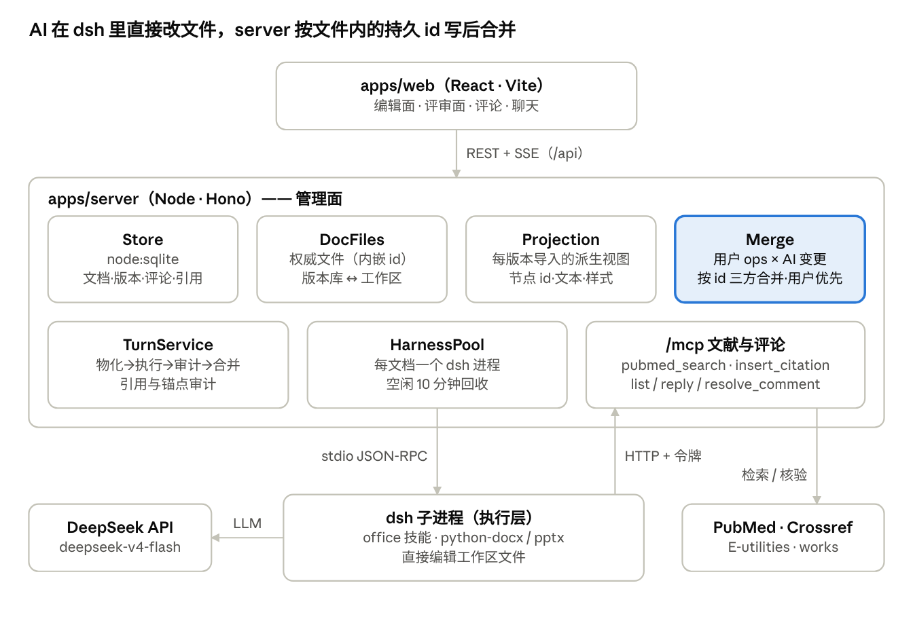
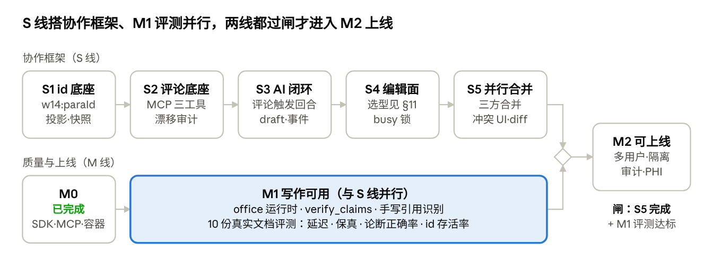

# Heurion 2.0 设计

**版本：** v0.3（2026-09-30）· **跟踪：** epic [#16](https://github.com/0xaicrypto/heurion2/issues/16) · **前端 Mock：** [docs/mock/README.md](mock/README.md) · **1.0 迁移：** [MIGRATION_PLAN.md](MIGRATION_PLAN.md)

Heurion 2.0 让用户用 AI 快速编辑 Word/PPT 医学文档，并在编辑中检索、规范引用医学文献。执行层是 DeepSeek Harness（dsh）TypeScript SDK `@deepseek-ai/dsh-sdk-client@0.2.0-rc.2`（npm `next`，MIT），heurion 是管理面。

**目录**

1. [概述](#1-概述)
2. [架构](#2-架构)
3. [接口](#3-接口)
4. [数据模型与存储](#4-数据模型与存储)
5. [统一编辑框架](#5-统一编辑框架)
6. [引用与论断规范](#6-引用与论断规范)
7. [前端](#7-前端)
8. [运行与部署](#8-运行与部署)
9. [决策记录](#9-决策记录)
10. [已知限制与风险](#10-已知限制与风险)
11. [里程碑](#11-里程碑)

---

## 1. 概述

### 1.1 产品目标：评论驱动的并行协作编辑

1. **用户手动编辑与 AI 修改并行**：同一份文档两个写者，按节点合并、用户优先，互不推倒。
2. **评论是给 AI 的带锚点编辑指令**：用户选中内容写评论，AI 经评论工具读取结构化锚点并据此修改，不靠复述原文。
3. **初稿可由 AI 全文生成**：draft 是三条写路径之一，不是特殊通道。

### 1.2 原则

**执行层归 dsh，管理面归 heurion。**

- dsh 负责：对话循环、工具执行、LLM 调用、子代理、上下文压缩、office 文件读写。
- heurion 负责：真相存储与版本、投影与 id、评论与锚点、合并治理、文献与引用、审计、前端。
- dsh 已有的能力不在本仓库重复实现；确需自研的在本文档记录原因（见 `CLAUDE.md`）。

### 1.3 当前状态

| 阶段 | 状态 |
| --- | --- |
| M0 架构跑通 | ✅ 已完成（提交 `fd0791e`）：SDK 接入、文献 MCP、引用校验与自修、版本与回滚、精简前端、Podman 容器。实测 Word 起草 36s、Word 编辑 43s、PPT 新建 245s |
| S1 id 底座 | 进行中（本地未提交）：`docs/office.ts` 做 paraId 补号 / 去重、docx/pptx 投影、id 存活率；落版时（`DocFiles`）生成投影并写 `versions.meta.id_survival`；新增 `GET /api/docs/:id/projection` 与 `id_survival_warning` 事件 |
| 其余 | 见 [§11](#11-里程碑) |

## 2. 架构



| 组件 | 位置 | 职责 |
| --- | --- | --- |
| web | `apps/web` | React/Vite。文档列表、编辑/评审面、评论、聊天、版本、引用 |
| Store | `apps/server/src/db.ts` | `node:sqlite`。文档、版本、投影、消息、引用（评论表待 S2） |
| DocFiles | `apps/server/src/docs/workspace.ts` | 版本库（权威文件）↔ 工作区（dsh 执行现场）；落版、回滚 |
| Projection | `apps/server/src/docs/office.ts` | 每版本导入生成的派生视图；paraId / shape id；id 存活率（S1） |
| Merge | —（S5） | 用户 ops × AI 变更，按 id 三方合并，用户优先 |
| TurnService | `apps/server/src/docs/turn.ts` | 一轮 AI 编辑：物化 head → dsh 执行 → 引用审计（自修一次）→ 落版 |
| HarnessPool | `apps/server/src/harness/pool.ts` | 每文档一个 dsh 子进程；空闲回收；取消 = 关进程 |
| 事件映射 | `apps/server/src/harness/events.ts` | dsh SDK 通知 → 前端 `UiEvent` |
| 文献 MCP | `apps/server/src/literature/` | PubMed / Crossref 客户端、引用登记与校验、`/mcp` 服务 |
| dsh 子进程 | profile `sdk` + `harness/profile/heurion.cordis.yml` | 在工作区里直接改文件；经 `/mcp` 回连 server |

harness 依赖只允许出现在 `HarnessPool` 与事件映射两个模块，便于日后替换执行层（见 [§9](#9-决策记录)）。

## 3. 接口

前端**不直接**访问 dsh。三层调用：

```
apps/web ──REST + SSE (/api)──▶ apps/server ──SDK: stdio JSON-RPC──▶ dsh 子进程
                                     ▲                                  │
                                     └──────── HTTP MCP (/mcp) ◀────────┘
```

### 3.1 前端 ↔ server：REST + SSE

**鉴权**：`Authorization: Bearer <HEURION_DEV_TOKEN>`（M2 前的占位）；下载链接用 `?token=`。实现：`apps/server/src/routes/api.ts`。

| 方法 | 路径 | 用途 | 请求 → 响应 |
| --- | --- | --- | --- |
| GET | `/api/docs` | 文档列表 | → `Doc[]` |
| POST | `/api/docs` | 新建或上传 | multipart：`file`（.docx/.pptx），或 `title` + `kind`（`docx`/`pptx`）→ `Doc`（201） |
| GET | `/api/docs/:id` | 文档详情 | → `Doc` + `busy`、`versions[]`、`messages[]`、`citations[]` |
| GET | `/api/docs/:id/projection` | 版本投影（S1） | `?seq=`（缺省为 head）→ `{ doc_id, seq, projection }`；无投影 404 |
| GET | `/api/docs/:id/versions/:seq/file` | 下载某版本 | → 文件（`?token=`） |
| POST | `/api/docs/:id/versions/:seq/restore` | 回滚 | → 新 head `Version`；AI 编辑中 409 |
| POST | `/api/docs/:id/chat` | 发起一轮 AI 编辑 | `{ "message": string }` → **SSE**；AI 编辑中 409 |
| POST | `/api/docs/:id/cancel` | 取消当前回合 | → `{ ok: true }`（关闭该文档的 dsh 进程） |

**`/chat` 的 SSE 事件**：每帧 `data: <JSON>`，类型为 `UiEvent`（`harness/events.ts`）。粒度是「步」而不是 token。

| `type` | 字段 | 含义 |
| --- | --- | --- |
| `status` | `status: 'running' \| 'idle'` | dsh 开始 / 结束工作 |
| `reasoning` | `text` | 模型思考 |
| `assistant` | `text` | 模型可见回复 |
| `tool_call` | `callId, name, arguments` | 工具调用（如 `mcp__heurion-literature__pubmed_search`、`bash`） |
| `tool_result` | `callId, isError` | 工具结果 |
| `turn_end` | `reason` | 回合结束（`completed` / `error` …） |
| `citation_audit` | `ok, unregisteredDois[]` | 引用校验结果（仅违规或自修时发） |
| `version` | `seq` | 本轮落成的新版本 |
| `id_survival_warning` | `rate` | 本轮 id 存活率低于 `ID_SURVIVAL_WARN`（0.8），疑似整文重写（S1） |
| `error` | `message` | 可读错误（如缺少 API key → 明确提示） |
| `done` | — | 流结束（最后一帧） |

调用示例（浏览器 `EventSource` 不支持 POST，用 `fetch` 读流，见 `apps/web/src/api.ts`）：

```ts
const res = await fetch(`/api/docs/${id}/chat`, {
  method: 'POST',
  headers: { Authorization: `Bearer ${TOKEN}`, 'Content-Type': 'application/json' },
  body: JSON.stringify({ message: '在引言后新增「作用机制」小节' }),
})
const reader = res.body!.pipeThrough(new TextDecoderStream()).getReader()
// 按 "\n\n" 切帧，取 "data:" 行 JSON.parse → UiEvent
```

```sh
curl -N -H 'Authorization: Bearer dev' -H 'Content-Type: application/json' \
  -d '{"message":"..."}' http://localhost:8787/api/docs/<id>/chat
```

### 3.2 server ↔ dsh：TypeScript SDK

实现：`apps/server/src/harness/pool.ts`。

```ts
new DeepSeekHarness({
  profile: 'sdk',
  patches: [PROFILE_PATCH],     // heurion.cordis.yml
  cwd: workspaceDir(docId),     // 该文档的工作区（SDK 工作区是进程级的）
  dshHome, provider, model,     // deepseek-official / deepseek-v4-flash
  env: childEnv(docId),         // 显式白名单
})
await harness.run(prompt, { sessionId, onNotification })  // → { sessionId, finalResponse, events }
await harness.close()                                    // 空闲回收 / 取消
```

- **通知**：`session.event`（会话日志事件：`assistant/message`、`tool/result`、`turn/end` …）与 `session.status`（`running` / `idle`）。`mapNotification()` 只取根会话，转成 `UiEvent`。
- **子进程 env**：`PATH`、`HOME`、`LANG`、`DEEPSEEK_API_KEY`、`HEURION_MCP_URL`、`HEURION_MCP_TOKEN`（按文档签发）、`DSH_PRIMARY_RUNTIME`、`PIP_NO_INDEX=1`；不继承父进程其他变量。
- **profile patch**（`heurion.cordis.yml`）：去掉 `session-log-deepseek`；关闭 `tool-web` / `web-search-deepseek` / `web-fetch-http` / `web`；人设（原地编辑、禁止装包、引用规范）；挂文献 MCP。
- **SDK 限制**：无取消（关进程）；无权限回调；跨进程无法恢复会话（新进程开新会话，首轮带最近 6 条对话）。

### 3.3 dsh → server：文献 MCP

dsh 启动时按 profile 连接 `HEURION_MCP_URL`（默认 `http://127.0.0.1:8787/mcp`，Streamable HTTP，无状态），`Authorization: Bearer <文档令牌>`（`<docId>.<HMAC>`，`literature/token.ts`）。模型看到的工具名为 `mcp__heurion-literature__<tool>`。

| 工具 | 参数 | 作用 |
| --- | --- | --- |
| `pubmed_search` | `query, limit≤20` | PubMed 检索（esearch → esummary），返回 PMID / DOI / 标题 / 作者 / 期刊 / 年份 |
| `doi_lookup` | `doi` | Crossref 核实 DOI |
| `insert_citation` | `doi, pmid?` | 登记引用 → `{ number, doi, formatted }`（AMA）；DOI 查不到则 `isError` |
| `list_citations` | — | 本文档已登记引用（按登记顺序编号） |

### 3.4 计划中的接口

| 接口 | 内容 | Issue |
| --- | --- | --- |
| 评论 REST | 列表 / 创建 / 回复 / resolve / reopen | #2 |
| 评论 MCP | `list_comments` / `reply_comment` / `resolve_comment` | #2 |
| 评论触发回合 | 复用 `POST /chat`，prompt 由服务端组装（含 commentId） | #3 |
| SSE 新事件 | `comment_updates`、`tool_result.code`（#3）；`claim_check`（#8）；`merge_result`（#6） | #3 #6 #8 |
| WOPI（若选 Collabora） | CheckFileInfo / GetFile / PutFile ↔ 版本库 | #4 #5 |
| 引用原文链接 | `citations.url`，前端一键打开 | #10 |

## 4. 数据模型与存储

### 4.1 表（`node:sqlite`，`apps/server/src/db.ts`）

| 表 | 主要列 | 说明 |
| --- | --- | --- |
| `docs` | `id, title, kind(docx\|pptx), session_id, head_seq, created_at, updated_at` | `head_seq` 为当前版本；`session_id` 为最近一次 dsh 会话 |
| `versions` | `doc_id, seq, sha256, source(upload\|ai\|restore), note, meta, created_at` | 只增不改；`meta` 为 JSON（如 `id_survival`，S1） |
| `projections` | `doc_id, seq, projection, created_at` | 每版本一份投影 JSON（S1） |
| `messages` | `id, doc_id, role(user\|assistant), text, created_at` | 对话记录；新会话首轮取最近 6 条 |
| `citations` | `id, doc_id, doi, pmid, formatted, created_at`，`UNIQUE(doc_id, doi)` | 同文档同 DOI 只登记一次；`url` 列待 #10 |
| `comments` / `comment_replies` | 见 [§5.4](#54-评论闭环) | S2 |

### 4.2 文件（`HEURION_DATA_DIR`，默认仓库根 `data/`）

```
data/
  heurion2.db                       SQLite
  versions/<docId>/<seq>.<docx|pptx> 版本库：权威副本
  workspaces/<docId>/               dsh 工作区：document.docx 或 deck.pptx + 辅助脚本
  dsh-home/                         dsh 会话与 profile
```

### 4.3 投影 schema（v1）

```ts
interface Projection { nodes: ProjectionNode[]; slides?: ProjectionSlide[] }
interface ProjectionNode {
  id: string                 // docx: w14:paraId；pptx: slidePart#cNvPr@id
  kind: 'heading' | 'paragraph' | 'list' | 'table' | 'opaque'
  level?: number; text: string; runs?: unknown; geometry?: unknown; locked?: boolean
}
```

投影不是真相，是每版本导入生成的派生视图。原始 OOXML 无法直接按节点挂锚点、做段落 diff 或三方合并，投影把文件变成带 id 的节点列表；锚点、合并 base、版本 diff 都基于它。schema 覆盖不到的内容（SmartArt、域代码等）落为 `opaque`：可评论、不可编辑。

## 5. 统一编辑框架

持久 id 写在文件里，模型只管改内容、不管寻址；管理面按 id 对比前后版本，得出谁改了哪个节点。

### 5.1 身份：持久 id 在文件里

- **docx**：段落 id 用 OOXML 原生 `w14:paraId`（Word 2010+ 协同编辑的官方锚点）。导入时提取；缺失则分配（python-docx 生成的文件没有 paraId）；重复（模型复制段落）则重分配。
- **pptx**：复合 id `slidePart#cNvPr@id`；页 id = slide part 路径。
- **用户手工修改**：编辑面内保存 → 落新版本 → 重新导入投影，id 沿用文件内 paraId / shape id，新节点补 id、重复 id 重分配。编辑面外修改（下载后用 Word / PowerPoint 改完上传）= 一次用户保存；Word 会保留 paraId。
- **id 存活率**：未被要求修改的节点中 id 保留的比例，写入 `versions.meta.id_survival`；低于阈值（`ID_SURVIVAL_WARN = 0.8`）按「整文重写」处理：降级为文本对齐重建锚点，并进评测指标。
- **实测依据**：容器内「新增作用机制小节」一轮，模型用 python-docx 原地插入，v1 的 5 个段落在 v2 中字节完全不变。
- **风险**：模型若重跑上轮留下的生成脚本（如 `build_docx.py`）整文件重生成，所有 id 丢失。防护：每回合前清理工作区脚本；人设要求原地编辑；id 存活率审计。

### 5.2 三条写路径

| 路径 | 执行者 | 流程 |
| --- | --- | --- |
| ① draft 全文生成 | dsh | 模型生成整个 docx/pptx → 快照 → 导入投影并分配缺失 id → v1 |
| ② 用户手动编辑 | heurion 管理面 | 编辑面保存 → 按节点打回权威文件，只重写被触碰的节点；实现取决于编辑面选型（[§9](#9-决策记录)） |
| ③ 评论驱动修改 | dsh | 评论触发回合 → `list_comments` 拿锚点与指令 → 原地改文件 → `reply_comment` 说明 → 快照 |

路径 ②：选 Collabora 则编辑器保存整文件，管理面按 paraId 对比得到用户 ops；选 TipTap 则需自研 XML 补丁器（预估 1–2k 行），只做节点级手术补丁，避免 docx→HTML→docx 重序列化的样式漂移。

### 5.3 守卫 = 写后合并（用户优先）

dsh 直接写文件，管理面没有写前拦截点，守卫放在写后。

- **S4**：AI 回合窗口内暂停用户保存（busy 锁）；回合快照时 head 已被用户推进 → 拒绝落版、提示重试。
- **S5**：按节点 id 三方合并（base 投影 × 用户 ops × AI 变更）：异节点双方保留；同节点冲突**用户赢**，AI 该节点改动丢弃并在线程里说明；合并后重跑锚点漂移审计。
- deck 形状级细粒度并行暂缓，待评测后决策。

### 5.4 评论闭环

```
comments(id, doc_id, kind, anchor_json, status open|resolved, resolved_by user|ai, created_at)
  anchor_json = { para_id?, shape_id?, slide_id?, text_snippet, section_index? }
comment_replies(id, comment_id, role user|ai, text, created_at)
```

MCP 工具（docId 从文档令牌派生；评论按 id + docId 双重过滤，防跨文档枚举）：

- `list_comments({status?, comment_id?})`：open 线程附锚点诊断，`located` 布尔值，漂移时给最近候选文本。
- `reply_comment({comment_id, text})`：role 由服务端固定为 `ai`，模型不可自封用户。
- `resolve_comment({comment_id})`：前置条件是线程最后一条回复出自 AI（仅用于「无需改动、已说明」）；用户可随时 reopen。

流程：评论创建 → 触发回合 → 模型读锚点 → dsh 改文件 → `reply_comment` → 快照合并 → `comment_updates` 事件 → 前端刷新线程与高亮。

### 5.5 锚点保护

- **软门**：人设纪律，删除或整替内容前先 `list_comments` 核对该范围的 open 评论；会清空锚点时先 `reply_comment` 说明，或缩小改法保留锚点原文。
- **硬检测**：每次落版后重跑锚点漂移审计（与引用审计同一位置），定位失败的线程标「漂移」。
- **兜底**：整轮回滚。

## 6. 引用与论断规范

正式引用只能来自 `insert_citation`；校验只保证文献真实，不保证论断正确，论断另由 `verify_claims` 核对。

1. **登记**：`insert_citation(doi)` 要求 DOI 在 Crossref 查得到，否则拒绝；同文档同 DOI 只登记一次，按登记顺序编号。
2. **校验**：回合结束后抽取正文（`word/document.xml`、`ppt/slides/*.xml`），文中出现未登记的 DOI 即违规（`literature/audit.ts`）。
3. **自修**：违规时让模型修一次（登记或删除，再按 `list_citations` 重建参考文献表）；仍违规就丢弃本回合的文件改动。
4. **原文链接**（#10）：登记时保存原文链接（优先 Crossref 返回的出版方 URL，否则 `https://doi.org/<DOI>`），注入文件列表中该文件的参考文献条目，一键打开。
5. **论断核对**（#8，`verify_claims`）：回合结束后抽取带引用标记的句子，逐句对照所引文献摘要（有 OA 全文时用全文片段），判定「支持 / 不支持 / 无法判断」；不支持的以 AI 评论挂到该句，由用户决定，不自动改写；无引用的数值型论断（HR、百分比、样本量）标「缺出处」。实测反例：PPT 把 SELECT 写成「提前终止」。
6. **手写引用**（#9）：无 DOI 的手写条目目前识别不了，需解析参考文献段落。

## 7. 前端

三栏：文档列表 ｜ 编辑 / 评审面 ｜ 评论 + 聊天 + 版本 + 引用。交互、状态、样式 token 以 [前端 Mock](mock/README.md) 为准。

| 区 | doc | deck |
| --- | --- | --- |
| 编辑面 | 候选 A：Collabora Online（WOPI 直开 docx）；候选 B：TipTap 绑投影（`opaque` 只读）；选中文本写评论 | 候选 A：Collabora（直开 pptx）；候选 B：pptx-react-viewer `canEdit`；点选形状写评论 |
| 评审面 | 段落级 diff（新增 / 删除 / 修改，对照上一版投影） | 只读画布：形状三态 diff + 评论锚点两态 overlay |
| 评论面板 | 线程列表（open / resolved、AI 回复、漂移徽标、「AI 处理中」） | 同左 |

样式：CSS 变量极简风 + 语义 token。三态 diff 色（added 绿 / removed 红 / modified accent）、锚点两态（常态 accent / 漂移 warning）、AI 单强调色、暗色跟随。

## 8. 运行与部署

### 8.1 本地开发

```sh
cp .env.example .env                 # 填 DEEPSEEK_API_KEY
pnpm install
pnpm --filter @heurion2/server dev   # http://127.0.0.1:8787
pnpm --filter @heurion2/web dev      # http://127.0.0.1:5173（/api 代理到 8787）
pnpm typecheck && pnpm test
pnpm --filter @heurion2/server smoke <docId>   # dsh 握手 +（有 key 时）一轮真实对话
```

### 8.2 容器

`scripts/container.sh build|up|down|logs`（Podman 或 Docker）。镜像 `node:24-bookworm-slim`，预装 python-docx、python-pptx、openpyxl、pandas、LibreOffice 7.4（无界面版）、Noto CJK 字体；server 直接托管前端构建产物；非 root；数据在命名卷 `heurion2-data`（macOS 上 bind mount 属主映射会导致无法写入）。

### 8.3 环境变量（`.env.example`）

| 变量 | 默认 | 说明 |
| --- | --- | --- |
| `DEEPSEEK_API_KEY` | — | 必填，dsh `deepseek-official` 路由使用 |
| `DSH_PROVIDER` / `DSH_MODEL` | `deepseek-official` / `deepseek-v4-flash` | 模型路由 |
| `HEURION_DATA_DIR` | `./data`（相对仓库根） | 数据目录 |
| `PORT` | `8787` | server 端口 |
| `HEURION_SECRET` | 开发默认值 | 文档 MCP 令牌的 HMAC 密钥，生产必填 |
| `HEURION_DEV_TOKEN` | `dev` | M2 前的 API 令牌 |
| `HEURION_MCP_URL` | `http://127.0.0.1:<PORT>/mcp` | dsh 回连地址 |
| `HARNESS_IDLE_MS` | 600000 | dsh 进程空闲回收 |
| `DSH_PRIMARY_RUNTIME` | 空 | office 运行时目录；空则不加载 dsh office 技能 |
| `NCBI_API_KEY` / `CONTACT_EMAIL` | 空 | 提高 PubMed 限速；Crossref polite pool |

### 8.4 Office 运行时

- **现状**：容器预装依赖替代了 dsh 官方运行时；提示词告知已预装、禁止装包；子进程 `PIP_NO_INDEX=1`。实测容器内模型不再装包，并能用 LibreOffice 渲染后看图自查（本机无预装时模型曾自建 venv 从 PyPI 下载）。
- **缺口**（#7）：dsh office 技能（含结构检查器 `check_office.py`）未加载。它要求 `DSH_PRIMARY_RUNTIME` 指向 `primary-runtime/`，该运行时只随 Python wheel 发布（PyPI 0.1.5rc1，与 npm 0.2.0-rc.2 不匹配）。候选：从 dsh 源码构建同版本运行时，或把技能文件复制为文件系统 skill。
- 只阻塞 AI 编辑质量评测，不阻塞 S1–S5。

### 8.5 数据外发与隔离

- profile 去掉 `session-log-deepseek`（默认随 DeepSeek 官方请求上传会话日志）；关闭 dsh 联网工具，外部检索只走 `/mcp`（经 PubMed / Crossref 客户端）。
- M2：每用户一个容器，只挂载该用户工作区；出口代理只放行 LLM 端点与 `/mcp`；启动自检 `session-log-deepseek` 必须已去掉（#13）。

## 9. 决策记录

### 9.1 已定

| 决策 | 选择 | 原因 / 代价 |
| --- | --- | --- |
| 执行层 | dsh TS SDK；harness 依赖只在 `HarnessPool` 与事件映射 | 与前后端同栈。代价：无取消、无权限回调、无会话恢复。同类备选 Claude Agent SDK（仅 Claude 模型、商业条款、默认收集使用数据），暂不切换 |
| 进程粒度 | 每文档一个 dsh 进程 | SDK 工作区是进程级的；MCP 令牌经进程 env 按文档注入 |
| 取消 | 关闭该文档的进程 | 冷启动实测 0.6–0.8s |
| 会话续接 | 进程内复用；新进程开新会话，首轮带最近 6 条对话 | SDK 对已存在的 sessionId 报 `already exists` |
| 权威文件 | heurion 版本库，文件内嵌持久 id | 工作区一次性；每回合覆盖写入 head 并清理上轮脚本 |
| 版本 | AI 回合与用户保存各落一版；回滚 = 旧版复制成新 head | 历史只增不改；AI 侧撤销粒度是整回合 |
| 寻址 | id 在文件里，模型不参与寻址 | 按 id diff 自知谁改了什么，消灭「复述原文失配」 |
| AI 编辑方式 | dsh 内 python / office 技能直接改文件 | heurion 不建 AI 侧 ops 执行器 |
| 守卫 | 写后合并、用户优先 | 管理面没有写前拦截点 |
| 评论 | 一等输入：锚点 + MCP 三工具 | 评论是结构化编辑指令，不再由前端拼自然语言 |
| 流式 | 按「步」推送 | SDK 只推已提交的会话日志事件 |
| 隔离粒度 | 按用户 | 安全边界最清楚 |
| 范围 | 2.0 先不做患者、病历、影像 | PHI 合规要求远高于写作，后续再增加 |

### 9.2 已定：用户编辑面 = Collabora Online（spike #4，2026-10-01）

**结论：采纳。** spike 完整验证记录见 [SPIKE_COLLABORA.md](SPIKE_COLLABORA.md)。要点：许可（源码 MPL-2.0，官方 CODE 二进制附专有条件、仅限测试/小团队——POC 合规，生产前在自建构建与 COOL 订阅间拍板）；集成面为最小 WOPI host（CheckFileInfo / GetFile / PutFile，`routes/wopi.ts`，协议层三入口已实测通过）；**PutFile 时间戳 + 409 `COOLStatusCode:1010` 原生承接「用户编辑期间 AI 落新版」的冲突询问（用户优先）**。

| 维度 | Collabora Online（WOPI 嵌入） | TipTap + XML 补丁器（备选，弃） |
| --- | --- | --- |
| 保真 | 直接编辑权威文件，LibreOffice 内核，与容器渲染同源 | 结构级视图；字体与页面观感有损，schema 外内容锁定 |
| doc/deck 一致性 | 一套编辑器覆盖两种格式 | 两套编辑器、两种保存模型 |
| 自研量 | WOPI 三入口 ~150 行（已验证） | 补丁器 1–2k 行 + 两套编辑器集成 |
| 冲突治理 | 编辑器原生弹「覆盖 / 重载」（409:1010），用户优先 | 需自建冲突 UI |
| 评论锚定 | 需同步文件内评论（`word/comments.xml` → paraId）→ S4 开放项 | 投影内选区直锚（面板已建） |
| 部署与许可 | 独立容器 ~1GB 内存；生产许可待拍板（不阻塞 S4/S5） | 无额外基建；pptx-react-viewer 许可待核实 |

用户 ops 的提取口径相应变化：Collabora 保存的是**整文件**，管理面把新文件与 base 投影按 paraId/shapeId 对比，diff 出用户 ops（同 §5.3 的合并输入）。

## 10. 已知限制与风险

上线前必须解决前两行。

| 限制 / 风险 | 影响 | 应对 |
| --- | --- | --- |
| 没有多用户鉴权（单一开发令牌） | 只能本地使用 | M2 #12：账户、按用户划分数据 |
| 进程内无隔离（danger-full-access） | 模型能访问进程可见的所有路径，容器内仍可联网 | M2 #13：每用户容器只挂工作区；出口白名单 |
| 模型可能整文件重生成 | id 全部丢失，锚点漂移、合并失效 | 清理脚本 + 人设原地编辑 + id 存活率审计（§5.1） |
| 论断正确性未校验 | 引用真实但论断可能错 | M1 #8 `verify_claims` |
| 锚点保护是软门 | AI 可能清空锚点后才被发现 | 漂移审计 + 整轮回滚；按触规率决定是否升级硬闸 |
| AI 回合窗口内暂停用户保存（S4） | 伪并行 | S5 三方合并后解除 |
| Collabora CODE 生产许可 | CODE 二进制附专有条件、不建议生产 | POC/本地合规；M2 前拍板：MPLv2 自建去标 vs COOL 订阅（[SPIKE_COLLABORA.md](SPIKE_COLLABORA.md)） |
| Collabora 文件内评论与评论表双源 | 用户在编辑器里写的评论需同步 | S4：解析 `word/comments.xml` 按 paraId 同步进评论表；AI 只写线程不回写 OOXML 评论 |
| frame_ancestors 限制 | 生产域名无法嵌入 iframe | M2：把集成域写进 coolwsd 配置 |
| SDK 没有权限回调 | 无法逐次审批工具调用 | 容器隔离兜底；确需逐次审批就改用 ACP |
| PPT 生成偏慢 | 实测 4 页 245s | M1 #11 评测中拆分模型耗时与渲染自查耗时 |
| dsh 0.x 不兼容变更 | 升级可能出问题 | 锁精确版本；升级单独提交，跑冒烟与评测 |

## 11. 里程碑



进入 M2 上线的闸：**S5 完成且 M1 评测达标**。M3 起（文献扩展、统计、投稿、记忆）见 [MIGRATION_PLAN.md](MIGRATION_PLAN.md)。

| 里程碑 | 内容 | Issue |
| --- | --- | --- |
| S1 id 底座 | paraId / shape id、投影 v1、版本快照接投影、id 存活率 | [#1](https://github.com/0xaicrypto/heurion2/issues/1) |
| S2 评论底座 | 评论表 + REST + MCP 三工具 + 漂移审计 + 评论面板 | [#2](https://github.com/0xaicrypto/heurion2/issues/2) |
| S3 AI 闭环 | 评论触发回合、人设纪律、draft 路径、新事件 | [#3](https://github.com/0xaicrypto/heurion2/issues/3) |
| 编辑面 spike | Collabora 嵌入 API 与许可验证 | [#4](https://github.com/0xaicrypto/heurion2/issues/4) |
| S4 用户编辑面 | Collabora 集成（WOPI host 已具雏形）+ 文件内评论同步 + busy 锁 | [#5](https://github.com/0xaicrypto/heurion2/issues/5) |
| S5 并行合并 + 评审面 | 三方合并、冲突 UI、段落 / 形状 diff | [#6](https://github.com/0xaicrypto/heurion2/issues/6) |
| M1 写作可用 | office 运行时 / `verify_claims` / 手写引用 / 原文链接 / 10 份文档评测 | [#7](https://github.com/0xaicrypto/heurion2/issues/7) [#8](https://github.com/0xaicrypto/heurion2/issues/8) [#9](https://github.com/0xaicrypto/heurion2/issues/9) [#10](https://github.com/0xaicrypto/heurion2/issues/10) [#11](https://github.com/0xaicrypto/heurion2/issues/11) |
| M2 可上线 | 账户 / 每用户容器 + 出口白名单 / 审计 + PHI + 导出 + 可观测性 | [#12](https://github.com/0xaicrypto/heurion2/issues/12) [#13](https://github.com/0xaicrypto/heurion2/issues/13) [#14](https://github.com/0xaicrypto/heurion2/issues/14) |
| 文档同步 | 设计文档与迁移计划回写 | [#15](https://github.com/0xaicrypto/heurion2/issues/15) |
