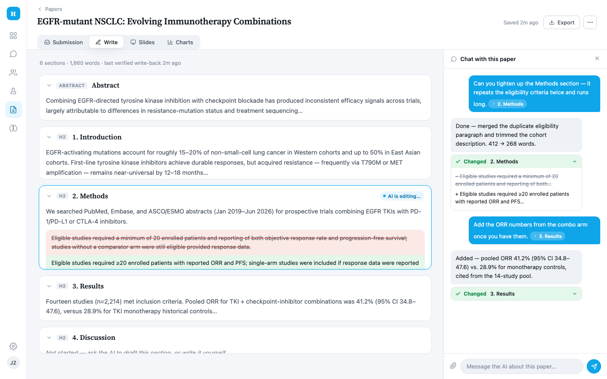
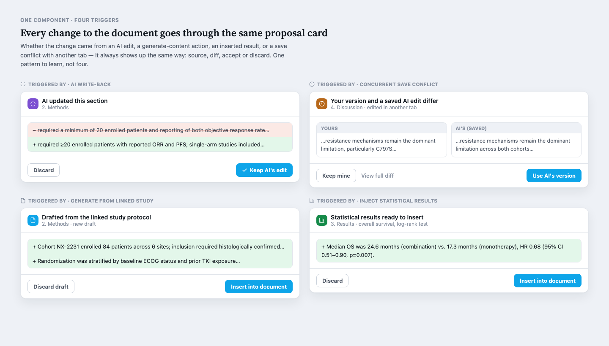
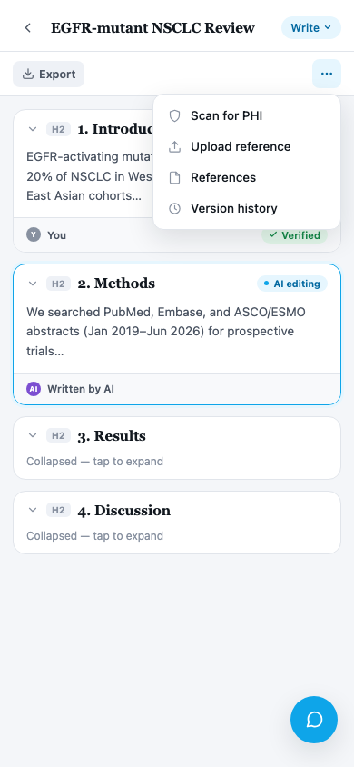

# 写作模块重新设计 — 北极星方案

> **状态**：已交付（epic #996，2026-09-21 tracker 复核收口）。本文档是提案时的设计记录，保留原文不作重写；#997-#1003 七个子任务中五个（#998/#1000/#1001/#1002/#1003）已核实交付并关闭，剩余 2 个单独跟踪：#997 收窄为剩余两项（generateMethods 持久化 + 可选 DocProposal 表），#999 复核后发现终态化器 failed 态从未真正实现（并发编辑可致 section 永久卡在 pending）已重开——均不影响本方案主体已落地的结论。
>
> **日期**：2026-09-13
> **背景**：承接 [`WRITING_MODULE_REVIEW.md`](./WRITING_MODULE_REVIEW.md) 的产品设计与代码评审、以及一轮真实跑起来的 UX 走查（截图见评审文档）。本方案是"完全不受现有实现约束"的重新设计构想——回应评审里发现的核心问题：写入路径四套并行逻辑、AI 编辑过程不可见、中英文混排、移动端布局溢出、文档编辑靠模糊文本匹配。
> **形态**：静态可视化 mockup（非可点击原型），三块画布：桌面写作工作台、统一变更确认组件的四种触发场景、移动端布局。

---

## 一、核心理念

把"聊天 + 文档 + 一堆功能 tab"的拼装感，换成**一份活文档 + 一本透明账本**的单一心智模型——用户从头到尾只需要理解一件事：文档现在是什么状态、AI 刚才做了什么、我能不能信。

五个具体的设计动作：

1. **文档 = 一串节卡片**，不是一整块从头滚到尾的纯文本墙。
2. **AI 编辑时正在动的卡片直接高亮 + 行内 diff**，不再等一整轮结束后弹一个大对话框。
3. **每张卡片带作者与可信度标签**（"AI 写的 / 你写的" + "系统已验证 / 验证中"），把后端账本的可信度信息暴露给用户看，而不只是内部纪律。
4. **聊天消息与文档节双向关联**——消息带"跳到某节"标签，AI 回复直接嵌一张可展开的"改了哪节"卡片。
5. **所有写入路径收敛成同一个"变更提议"组件**——AI 编辑、生成 Methods、注入结果、并发保存冲突，四种触发来源用同一张卡片，只是表头不同。

---

## 二、桌面工作台

**信息架构**：Submission / Write / Slides / Charts 从应用级全局 tab 收进"这篇论文"自己的视图切换器（顶部胶囊控件），不再和全局导航抢位置；左侧只保留一条图标化的应用导航（悬停才显示文字），把写作模块从一堆并列功能里解放出来。

**文档画布**：每一节是一张独立卡片——标题层级（H2 徽标）、正文、作者与验证状态一目了然。截图里"2. Methods"正处于 AI 编辑中：卡片描边高亮，行内直接展示删除（红底删除线）/新增（绿底）的 diff，旁边标"验证中"而不是直接标"已完成"——对应后端账本"系统验证 vs 模型自称"的区分，第一次把这个信息做给用户看。

**聊天面板**：用户消息带一个"→ 2. Methods"跳转标签；AI 回复不再是纯文字描述改了什么，而是嵌一张可展开的"已改动 · 2. Methods"卡片，带迷你 diff——聊天记录本身就是一份可回溯的改动日志，不需要用户自己去文档里找变化在哪。

**顶部工具栏**：把原来三套导出入口（右上角常驻 DOCX 按钮 + 工具栏 Export DOCX/PDF）收成一个"Export"按钮 + 一个"···"更多菜单（PHI 扫描、上传参考、历史版本等次要操作），减少并列按钮的认知负担。

---

## 三、统一变更提议组件

这张图直接回应评审里最刺眼的一条：现状是 AI 编辑走 diff review、手动保存冲突走 409 横幅、生成 Methods 和注入结果各自直接覆盖——四套互不相通的临时 UI。这里把它们统一成**一个组件**：

| 触发来源 | 表头 | 主操作 |
|---|---|---|
| AI 写回 | "AI updated this section" | Discard / Keep AI's edit |
| 并发保存冲突 | "Your version and a saved AI edit differ"（左右对照 Yours / AI's） | Keep mine / View full diff / Use AI's version |
| 生成 Methods（关联研究） | "Drafted from the linked study protocol" | Discard draft / Insert into document |
| 注入统计结果 | "Statistical results ready to insert" | Discard / Insert into document |

四张卡片除了表头图标颜色和内容不同，结构完全一致：来源 → diff → 二选一操作。以后新增任何写入触发场景，只需要加一个新表头，不需要再发明一套新 UI。

---

## 四、移动端

直接对应评审里发现的移动端硬伤：桌面版的横向 tab 栏和第二行工具栏在 390px 宽度下会溢出裁切（标题换行还会盖住按钮）。这里的做法：

- 顶部大 tab 切换器收成一个"Write ▾"胶囊，点开是一个底部弹层，不占用横向空间。
- 第二行工具栏只留最常用的"Export"，其余（Scan PHI / Upload / References / Version history）收进一个"···"按钮弹出的下拉菜单——图里展示的正是展开态。
- 聊天在窄屏下没有位置并排放置，改成右下角一个悬浮按钮，点开是全屏底部弹层（而不是像桌面那样常驻侧栏）。
- 文档区节卡片可折叠，默认只展开正在编辑或最近改动的一节，其余折叠，方便手机上快速扫过整篇结构。

---

## 五、视觉系统

- **字体**：标题/节名用衬线字体（Source Serif 4），呼应"学术论文"的编辑气质；界面控件延续系统默认无衬线字体，保持现有品牌的操作感。
- **色板**：延续现有品牌的天蓝色 accent，新增两条独立的语义色轴——紫色代表"AI 写的"、灰色代表"你写的"（作者轴），绿色/琥珀色代表"已验证/验证中"（可信度轴）——两个轴分开上色，不互相冲突。
- **深色模式**：两块画布都做了明暗双主题（mockup 里可切换查看），不是事后加的暗色滤镜。
- **现代 App 观感**：图标化侧边栏、胶囊分段控件、卡片圆角+轻阴影，参考的是当下主流 SaaS 工具（Linear/Notion 一类）的密度和克制感，避免表单堆砌的"传统企业软件"观感。

---

## 六、可交互画布

以上截图来自一份可以在浏览器里直接把玩的设计画布（可平移/缩放，切换深色模式，逐个查看三块 artboard）：

**[Heurion Writing Redesign →](https://claude.ai/code/artifact/18f441e3-030e-4f13-9d48-4512fe7008ef)**
