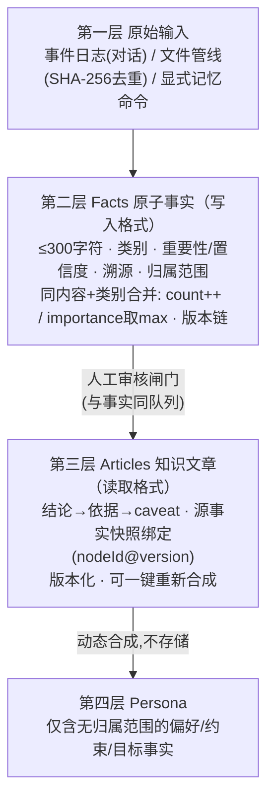
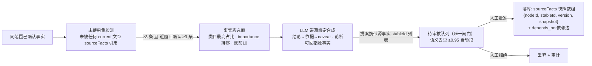
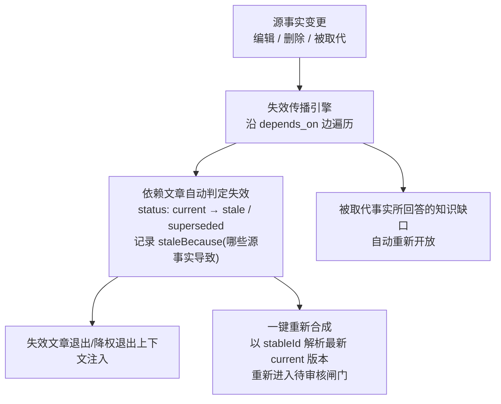
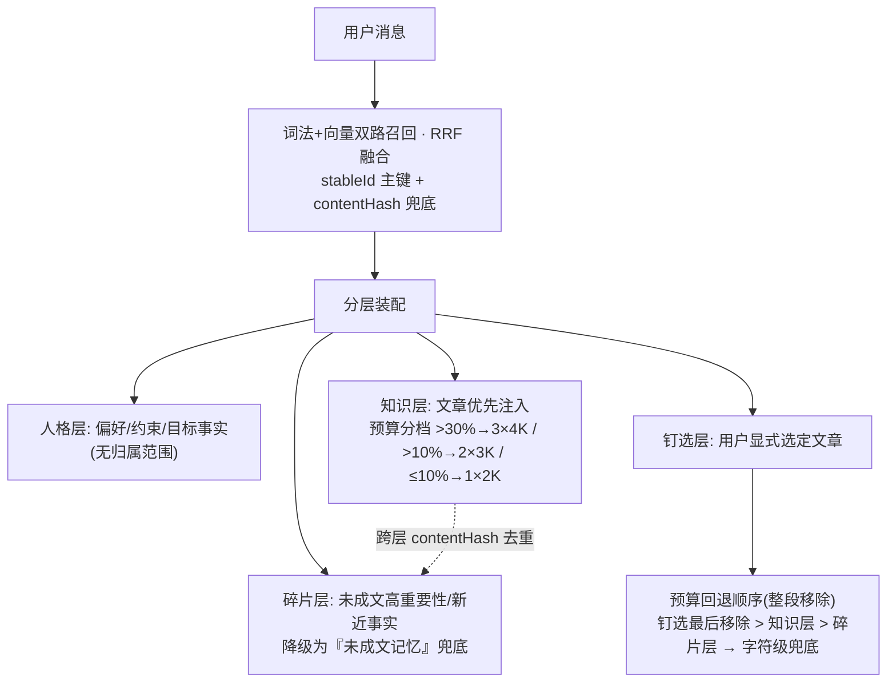
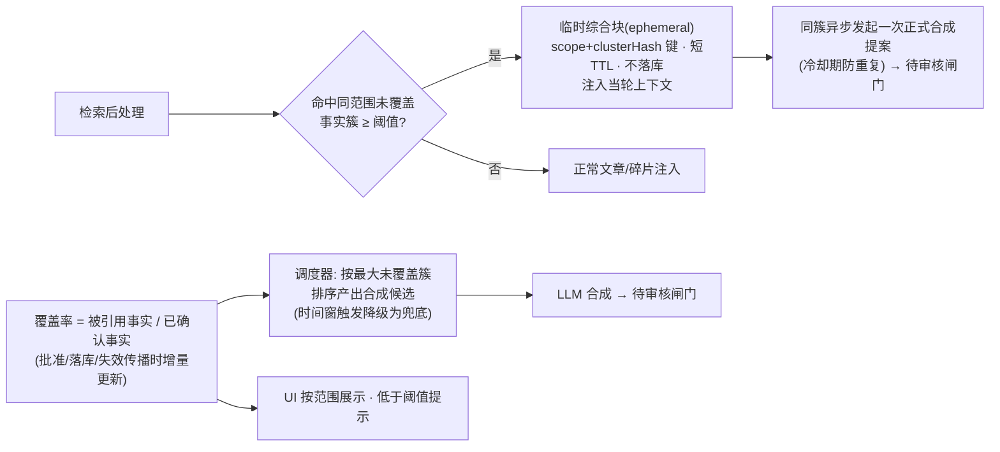
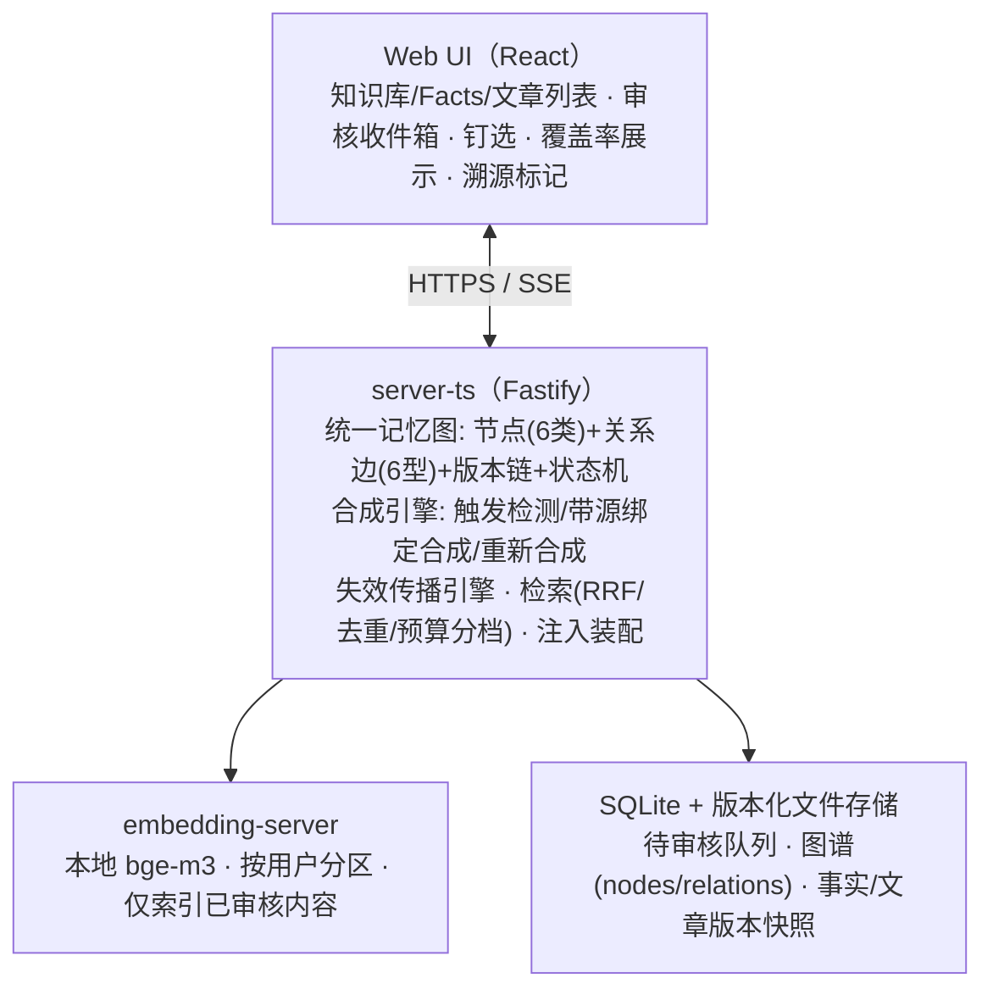

# 发明专利申请草稿（待代理人审阅）

> **性质**：技术交底书 → 申请文件草稿（内部初稿，未提交）
> **申请类型**：中国发明专利（可后续 PCT / US 进入）
> **对应代码**：Heurion（`packages/server-ts`，memory / retrieval / knowledge / chat）
> **策略**：专利组合第二案（姊妹案）——以「双形态知识分层（原子事实=写入格式 / 合成文章=读取格式）+ 溯源快照绑定 + 失效传播 + 人工审核式知识合成」为独立权利要求，与第一案《记忆生命周期与锚定压缩》互补、互不重复授权
> **状态**：草稿 v1（2026-09-02）。其中「可引用性契约、分层注入、JIT 惰性合成、覆盖率调度」为设计定稿阶段（issue #813–#816），其余特征均已实现并有测试锁定
> **关联文档**：第一案 `docs/patent/CN-申请草稿-记忆生命周期与锚定压缩.md`；产品设计 `docs/design/knowledge-base-design.md`；记忆生命周期 `docs/design/BRAIN2_MEMORY_LIFECYCLE.md`

---

## 〇、产品概述（内部理解用，非递交内容）

Heurion 是面向肿瘤临床与科研团队的自我进化 AI 工作站。其知识库不是静态文档库，而是一条持续运行的**知识生产线**：

```
对话 / 文件 / 病历（原始输入）
   → 原子事实 Facts（写入格式：对账 · 去重 · 冲突 · 溯源的最小真相单元）
   → 知识文章 Articles（读取格式：可溯源 · 可引用 · 可失效的上下文单元）
   → 人格 Persona（每次对话动态合成的稳定偏好/约束层）
```

**核心设计判断**：原子事实缺乏上下文，是给**系统**看的（对账、冲突检测、版本审计）；知识文章是给**模型**看的（推理、引用）。类比数据库的行存与物化视图——文章是事实之上的"物化视图"，源事实变化即自动失效并提示重建；一切合成产物与事实写入同样经由人工审核闸门，不存在直写路径。这使知识库随使用自动生长、自动修正、全程可审计，是"第二大脑"区别于普通 RAG 文档库的本质。

---

## 一、发明名称

一种基于双形态知识分层与失效传播的可进化知识库构建方法、装置及存储介质

（备选：一种面向 AI 会话的原子事实溯源合成与自动失效传播方法）

## 二、技术领域

本发明涉及人工智能与知识工程技术领域，具体涉及一种面向大语言模型（LLM）会话应用的可进化知识库构建方法，尤其涉及原子事实与合成知识文章的双形态分层存储、带溯源快照的知识合成、派生知识的自动失效传播，以及知识单元向会话上下文的可引用注入。

## 三、背景技术

大语言模型驱动的 AI 助手在长期使用中需要"记住"用户的知识与偏好。现有方案普遍采用以下两类做法，均存在结构性缺陷：

1. **原文切片式 RAG：知识静态、不可演进**。将用户上传的文档切片向量化后检索注入。切片是"原文的碎片"而非"整理过的知识"：不可编辑、不可版本化、不可随使用积累演化；文档更新后旧切片不失效；检索噪声直接污染上下文；且切片与用户对话中沉淀的个性化知识完全割裂。

2. **记忆=原子事实直接注入：库存而非知识**。现有记忆方案（如 Mem0 类系统）将提取出的原子事实（短句）直接注入上下文。原子事实缺乏上下文与逻辑组织，注入的碎片列表相当于"库存清单"而非"知识"：模型每一轮都需对同样的碎片重新做一次综合推理，综合成本从"写时一次性"被转移到"读时每一轮"；碎片之间潜在矛盾无法在注入前消解；长会话下 token 效率低下。

3. **知识自动合成、无审核、不可信**。部分方案由 AI 自动将记忆总结为知识卡片并直接写入知识库：合成过程引入的幻觉随注入静默传播，无法追责；在临床等高风险场景不可接受。

4. **派生知识不随源更新而失效**。当源事实被更正（如"既往青霉素过敏记录有误，现可用"）后，基于旧事实合成的知识文章继续存在并注入上下文，过时知识误导后续决策；多数方案中源与派生物之间甚至不存在任何链接，失效无从谈起。

5. **合成物不可溯源**。知识文章与其来源事实之间没有版本级绑定，无法回答"这篇文章的这段结论依据是哪条事实的哪个版本"，不满足医疗审计要求。

6. **合成覆盖不可度量、触发机制僵化**。哪些事实已成文、哪些主题从未被合成，无从度量；合成触发依赖硬编码条件（如"最近 N 天确认 ≥3 条"），长尾主题的原子事实永远不会被合成为知识，也无法在读时兜底。

## 四、发明内容

### 4.1 要解决的技术问题

针对上述背景技术中的至少一个问题，本发明提供一种可进化知识库构建方法，其能够：

- 将记忆显式划分为**写入格式（原子事实）**与**读取格式（知识文章）**两层，使综合成本从每轮转移到写时一次性完成，消除碎片注入（问题 2）；
- 使知识合成的产物与原子事实一样经由人工审核闸门写入，无直写路径（问题 3）；
- 在文章与源事实之间建立**版本级溯源快照绑定**，任一源事实变更即自动判定文章失效并传播（问题 4、5）；
- 建立知识**可引用性契约**，使注入上下文的每条知识可向对话输出溯源标记（问题 5）；
- 以**覆盖率指标**度量事实→知识的转化健康度并驱动合成调度，辅以**读时惰性合成**兜底长尾主题（问题 6）；
- 通过四层积累管线（原始输入→事实→文章→人格），使知识库随使用自动生长（问题 1）。

### 4.2 技术方案

#### 4.2.1 总体架构：四层积累与双形态分层

```
第四层 Persona（动态合成）：每次对话前由下层数据自动生成，仅含无归属范围的偏好/约束类事实
第三层 Knowledge/Articles（读取格式）：跨会话合成文章，版本化、可溯源、可失效
第二层 Facts（写入格式）：原子化断言，去重合并、冲突标记、版本链
第一层 原始输入：事件日志（对话）/ 文件管线（SHA-256 去重）/ 显式命令
```

全部实体（fact / article / gap / skill / entity / document）作为**统一记忆图**的节点存储，节点间以类型化关系边连接（derives_from 派生、depends_on 依赖、answers 回答、mentions 提及、supersedes 取代、related_to 关联）。每个节点具有：版本唯一 ID（`节点@版本`）、跨版本稳定 ID（stableId）、版本号、状态（current / stale / superseded / pending_review）、内容哈希、溯源信息（来源类型、证据引文、置信度、提取模型）。

#### 4.2.2 双形态知识分层与溯源合成（独立权利要求核心）

包括以下步骤：

**步骤 S1：原子事实层（写入格式）。** 从原始输入提取的每条事实为自包含的原子断言，受字符上限约束（如 ≤300 字符），携带：类别（偏好/约束/目标/事实/临床类目）、重要性（1–5）、置信度（低于阈值自动标记"不确定"）、溯源信息（来源类型与证据引文）、归属范围（患者/研究/全局）。同范围内内容与类别相同的重复观察执行**合并**：计数递增、重要性取历史最大值。事实仅作为对账、去重、冲突检测与版本审计的最小单元，**不以碎片列表作为主要形态注入会话上下文**。

**步骤 S2：统一人工审核闸门。** 事实提案与知识合成提案进入同一条待审核队列（第一案的闸门在本案知识层的复用）：入队前对提案内容向量化，与同范围已审核内容计算相似度，相似度不低于预设阈值（如 0.95）的重复提案自动拒绝；批准后写入版本化记忆图并构建向量索引，拒绝则仅记录审计。系统中不存在绕过该队列的知识写入路径。

**步骤 S3：合成触发与源绑定提案。** 检测同归属范围内**未被任何 current 文章引用**的已确认事实（未使用集）：当未使用集规模达到第一阈值（如 ≥3 条）且其中达到第二阈值数量的条目为最近预设时间窗内确认时，选取类目占比最高的事实簇，按重要性排序截取前 N 条（如 10 条），调用大语言模型执行**带源绑定的合成**——合成指令要求输出面向问题自包含的知识单元，且每个论断须能对应到源事实；合成产物以知识文章提案的形式（携带全部源事实的稳定 ID 列表）进入步骤 S2 的待审核队列，不直接落库。

**步骤 S4：溯源快照落库。** 文章提案经批准后写入图谱，持久化**源事实快照数组**：每条源事实记录 `节点ID / stableId / 版本号 / 内容快照` 四元组，并为每条源事实建立 depends_on 依赖边。由此，任一文章可在任意历史时点回答"该结论依据的是哪条事实的哪个版本"。

**步骤 S5：自动失效传播。** 当源事实被编辑、删除或被取代（supersede）时，失效传播引擎沿 depends_on 边自动将依赖该事实的每篇 current 文章判定为失效：文章状态变更为 stale（或同步 superseded），并记录失效原因（哪些源事实的哪个变化导致）；失效文章自动退出或降权退出上下文注入；同时开放一键重新合成，重新合成以源事实的 stableId 解析到**最新 current 版本**，避免重新绑定到已被取代的旧版本。

**步骤 S6：读取格式注入。** 会话上下文按读取格式分层装配：
- 人格层：仅由无归属范围的偏好/约束/目标类事实构建（此类事实天然自包含，属例外，不经文章）；
- 知识层：语义检索命中时**文章优先于裸事实**注入，按剩余上下文预算分档注入；
- 碎片层：未被文章覆盖的高重要性/新近事实降级为"未成文记忆"碎片注入，作为兜底；
- 用户钉选层：用户显式选定（钉选）的文章在预算回退时最后被移除。

#### 4.2.3 知识可引用性契约（从属特征）

- 合成指令要求文章具备结构化形态：**结论 → 依据 → 注意事项/不确定性（caveat）**，每个论断可回指步骤 S4 的源事实快照；
- 文章注入上下文时附带引用指令，要求模型在回答中引用文章内容时输出溯源标记，标记类型与来源形态对应（文件 / 事实 / 文章 / 用户钉选），通过流式事件下发前端渲染；
- 注入失效文章时附加失效标注（失效原因摘要），使模型可区分现行知识与过时知识。

#### 4.2.4 读时惰性合成（JIT synthesis，从属特征）

- 语义检索后处理：当命中结果中存在同归属范围、互相相关、且未被任何 current 文章的源事实快照覆盖的事实簇（规模不低于阈值）时，触发读时合成；
- 读时合成为**临时综合块**：仅注入当轮上下文（以 归属范围+事实簇哈希 为键做短 TTL 缓存），不落库、不占用审核队列；
- 同一事实簇异步发起一次正式合成提案进入待审核队列（复用步骤 S2–S3），并对同簇设置冷却期防止提案重复堆积；
- 临时综合块生成失败时静默降级为碎片注入，不阻塞对话回合。

#### 4.2.5 覆盖率度量与合成调度（从属特征）

- 定义覆盖率：某归属范围内，被至少一篇 current 文章的源事实快照引用的已确认事实数 ÷ 已确认事实总数；
- 在事实批准、文章落库、失效传播三类事件发生时增量更新；
- 合成调度由覆盖率缺口驱动：按"最大未覆盖事实簇"排序产出合成候选，替代纯时间窗触发（原触发条件降级为兜底）；
- 覆盖率可观测：遥测上报，并在用户界面按归属范围展示，低于预设阈值时提示用户沉淀或手动合成。

#### 4.2.6 统一检索与身份一致（从属特征）

- 检索对事实、文章、文档执行词法与向量双路召回，以倒数排序融合（RRF）合并；
- 融合以节点的跨版本稳定 ID（stableId）为主键，内容哈希为兜底身份，避免同实体多版本被当作不同结果重复注入；
- 不同注入层（知识层/碎片层）之间按内容哈希去重，同一内容不重复占用上下文预算。

#### 4.2.7 上下文预算治理（从属特征）

- 按剩余预算分档注入知识单元（如剩余 >30% 注入 3 篇×4K 字符；>10% 注入 2 篇×3K；≤10% 注入 1 篇×2K）；
- 超预算时按预设的段级回退顺序整段移除（用户钉选 > 知识层 > 碎片层），最后执行字符级截断兜底。

#### 4.2.8 其他从属特征

- **四层积累管线**：原始输入（事件日志/文件管线/显式记忆命令）→ 事实 → 文章 → 人格，逐层仅在满足条件时向上提炼；
- **知识缺口闭环**：问题形态且未被任何已确认事实覆盖的消息触发知识缺口记录（按预设时长去重）；缺口被事实/文章回答后关闭，源事实被取代时自动重新开放；
- **记忆图导出**：整图（节点+版本链+关系边）可导出为自包含归档格式，支持知识资产迁移；
- **双存储原子写**：图谱提交置于多存储写序列末尾，前置存储写入失败时按快照回滚；
- **归属范围隔离**：文章与事实同样携带归属范围；患者级知识仅注入该患者的会话，人格层永不吸收患者级知识。

### 4.3 有益效果

1. **写读分离、成本内化**：知识综合从"每轮重新综合碎片"变为"写时一次性合成"，上下文 token 效率显著提升，且注入内容具备逻辑组织，减少模型矛盾输出。
2. **可信合成**：合成产物与原子事实同闸门审核，无直写路径；未审核内容永不进入检索与注入。
3. **全程可溯源**：版本级源快照绑定 + 可引用性契约，使模型回答中的每条知识可回溯到"哪条事实的哪个版本"，满足医疗审计。
4. **知识保鲜**：失效传播保证派生知识不滞后于源事实更正，过时知识自动退出注入；重新合成始终绑定最新版本。
5. **覆盖可度量、长尾有兜底**：覆盖率指标量化 facts→article 转化健康度并驱动调度；读时惰性合成保证未成文主题的查询质量，且沉淀路径与审核闸门一致。
6. **资产化**：知识库随对话/文件自动生长、自动修正，可整图导出迁移，形成可复用的团队知识资产。

## 五、附图说明

下列图 1–图 6 为说明本发明的示意性附图（正式递交时按审查指南要求重绘为黑白线条图）。各图以 Mermaid 源码给出，可在 GitHub / Typora 等支持 Mermaid 的渲染器中查看；PNG 版本（本机渲染，1400×2 缩放）已位于 `docs/patent/figs/`，并嵌入同目录 docx。

### 图 1：四层知识积累与双形态分层架构图




### 图 2：带源绑定的知识合成流水线




### 图 3：失效传播流程图




### 图 4：读取格式分层注入与预算回退




### 图 5：读时惰性合成与覆盖率调度




### 图 6：系统架构框图




## 六、具体实施方式

### 6.1 运行环境

本发明的示例实施为临床科研 AI 工作站，后端为 TypeScript + Fastify + SQLite（待审核队列、提案元数据）+ 按用户隔离的版本化文件存储（事实、文章、图谱的节点与关系边以版本化 JSON 快照持久化），前端为 React 单页应用，通过 SSE 流式通信；嵌入服务为本地 ONNX 向量模型（bge-m3，1024 维），语义检索按用户分区。记忆图作为统一门面对外提供读写服务，旧格式存储作为投影双写保持兼容。

### 6.2 数据模型示例

- 事实节点：`{ id: 'fact_x@v2', stableId: 'fact_x', type: 'fact', status, content(≤300字符), contentHash, version, importance(1-5), category('preference'|'constraint'|'goal'|'fact'|'diagnosis'|'symptom'|'exam'|'medication'|'allergy'|'plan'|'context'), confidence, uncertain(confidence<0.6), patientHash?, studyId?, sourceType, count, provenance: { sourceKind, evidenceQuote, extractionModel } }`；
- 文章节点：`{ id, stableId, type: 'article', title, content, status('current'|'stale'|'superseded'), sourceFacts: [{ nodeId, stableId, version, snapshot }], sourceDocuments?, staleBecause?: string[] }`；
- 关系边：`{ type: 'derives_from'|'depends_on'|'answers'|'mentions'|'supersedes'|'related_to', from, to }`；
- 待审核提案：`{ id, kind('fact'|'article'|'episode_summary'|'compaction_summary'), scopeType, patientHash?, studyId?, content, relatedFacts?(源事实 stableId 列表), conflictsWith?, status('pending'|'approved'|'rejected'), ... }`。

### 6.3 关键实施细节

- **合并去重**：同归属范围内 `content + category` 相同的重复观察合并为一条（count 递增、importance 取历史最大值），同 scope 提案语义去重阈值 0.95；
- **合成触发检测**：以"未被任何 current 文章的 sourceFacts 引用"为未使用判定，取同 scope 类目占比最高的簇，importance 降序截前 10 条送合成；
- **失效判定**：文章的任一源事实（按 stableId）当前状态非 current 即判定 stale；编辑/删除/取代三类源变更均触发传播；传播在事实变更事务的补偿式原子写之后异步执行，失败可幂等重放；
- **重新合成**：以源事实 stableId 解析最新 current 版本节点（而非提案时的旧版本 ID），合成结果作为文章新版本提交（旧版本保留审计）；
- **检索融合**：词法与向量两路召回各取 Top-N，RRF 融合排序；注入层间按 contentHash 去重；患者会话注入前按 patientHash 过滤；
- **可引用性**：合成提示词要求"结论→依据→caveat"结构与逐论断可回指；注入文章时附带引用指令与源事实置信度/来源摘要；前端经 SSE 事件接收四类溯源标记（文件/事实/文章/钉选）渲染；
- **临时综合块**：以 `scope + sortedFactStableIds 的哈希` 为缓存键，TTL 分钟级；同簇正式提案的冷却判定读取该缓存键对应的提案记录。

### 6.4 测试验证

- **无直写路径断言**：文章合成产物仅能经待审核队列落库；直接调用写入接口被拒绝并审计；
- **失效传播**：编辑/取代源事实 → 断言依赖文章状态迁移为 stale、staleBecause 记录源变更、重新合成绑定最新版本；
- **溯源完整性**：任一文章可由 sourceFacts 快照数组回放出"结论—事实版本"对应关系；重新生成后快照不指向已取代版本；
- **覆盖率不变量**：事实批准/文章落库/失效传播三类事件后覆盖率与全量重算一致；
- **去重与身份**：同实体词法+向量双路命中在 RRF 中合并为一条；注入层间无同 contentHash 重复；
- **JIT 兜底**：无文章覆盖的事实簇查询返回当轮综合块且带溯源；同簇冷却期内不重复产生提案；合成失败降级为碎片注入且对话回合不受阻塞。

## 七、权利要求书（草稿）

### 权利要求 1（独立权利要求——方法）

一种可进化知识库构建方法，其特征在于，包括：

将从原始输入中提取的记忆组织为双形态分层结构，包括原子事实层与知识文章层；所述原子事实为受字符上限约束、携带类别、重要性、置信度、溯源信息与归属范围的自包含断言，同归属范围内内容与类别相同的重复观察被合并；所述知识文章为由多条原子事实合成的、作为会话上下文注入单元的知识内容；

检测同归属范围内未被任何现行知识文章引用的已确认事实，当未使用事实的规模达到第一阈值且其中达到第二阈值数量的条目为最近预设时间窗内确认时，选取事实簇调用大语言模型执行带源绑定的合成，合成产物作为知识文章提案进入人工审核队列，所述人工审核队列是事实与知识文章写入的唯一闸门，不存在绕过所述人工审核队列的直接写入路径；

响应于对所述知识文章提案的批准操作，将所述知识文章写入版本化知识图谱，并持久化源事实快照数组，所述源事实快照数组中的每个条目记录对应源事实的节点标识、跨版本稳定标识、版本号与内容快照，且为每条源事实建立依赖关系边；

响应于源事实的编辑、删除或取代操作，沿所述依赖关系边自动将依赖该源事实的现行知识文章判定为失效，将失效文章的状态变更为失效或被取代并记录失效原因，使失效文章退出上下文注入；重新合成时以所述跨版本稳定标识解析到源事实的最新现行版本进行绑定。

### 权利要求 2（从属——源快照结构）

根据权利要求 1 所述的方法，其特征在于，所述源事实快照数组中的内容快照为源事实在该版本号下的内容文本，使得任一知识文章在任意历史时点可回溯其结论所依据的源事实内容。

### 权利要求 3（从属——可引用性契约）

根据权利要求 1 所述的方法，其特征在于，所述合成的指令要求所述知识文章具备结论、依据与注意事项的结构化形态，且每个论断可对应到所述源事实快照数组中的条目；所述知识文章注入会话上下文时附带引用指令，使模型在回答中引用文章内容时输出与来源形态对应的溯源标记。

### 权利要求 4（从属——失效文章标注）

根据权利要求 1 所述的方法，其特征在于，被判定为失效的知识文章在注入上下文时附加失效标注，所述失效标注包含所述失效原因的摘要。

### 权利要求 5（从属——原子事实属性）

根据权利要求 1 所述的方法，其特征在于，所述原子事实的置信度低于预设阈值时被自动标记为不确定；所述合并包括计数递增与重要性取历史最大值。

### 权利要求 6（从属——语义去重）

根据权利要求 1 所述的方法，其特征在于，提案进入所述人工审核队列前，对提案内容向量化并与同归属范围内已审核内容计算相似度，相似度不低于预设阈值的提案被自动拒绝。

### 权利要求 7（从属——分层注入）

根据权利要求 1 所述的方法，其特征在于，会话上下文按读取格式分层装配：人格层仅由无归属范围的偏好、约束与目标类原子事实构建；知识层在语义检索命中时优先注入知识文章、按剩余上下文预算分档注入；碎片层注入未被知识文章覆盖的高重要性与新近原子事实作为兜底；用户显式选定的知识文章在预算回退时最后被移除。

### 权利要求 8（从属——跨层去重与身份一致）

根据权利要求 7 所述的方法，其特征在于，检索对原子事实、知识文章与文档执行词法与向量双路召回并以倒数排序融合合并，融合以所述跨版本稳定标识为主键、内容哈希为兜底；不同注入层之间按内容哈希去重。

### 权利要求 9（从属——读时惰性合成）

根据权利要求 1 所述的方法，其特征在于，还包括：语义检索后，当命中结果中存在同归属范围且未被任何现行知识文章覆盖的事实簇、其规模不低于阈值时，生成临时综合块仅注入当轮上下文，所述临时综合块以归属范围与事实簇哈希为键做短时限缓存且不持久化；同时对该事实簇以冷却期控制发起至多一次正式合成提案进入所述人工审核队列；临时综合块生成失败时降级为原子事实碎片注入。

### 权利要求 10（从属——覆盖率调度）

根据权利要求 1 所述的方法，其特征在于，还包括：按归属范围统计覆盖率，所述覆盖率为被至少一篇现行知识文章的源事实快照引用的已确认事实数与已确认事实总数之比，并在事实批准、文章落库与失效传播时增量更新；合成候选按未覆盖事实簇的规模排序产出，所述最近预设时间窗的触发条件降级为兜底。

### 权利要求 11（从属——知识缺口联动）

根据权利要求 1 所述的方法，其特征在于，问题形态且未被任何已确认事实覆盖的消息触发知识缺口记录，同一知识缺口按预设时长去重；所述知识缺口被事实或知识文章回答后关闭，在源事实被取代时自动重新开放。

### 权利要求 12（从属——归属范围隔离）

根据权利要求 1 所述的方法，其特征在于，所述原子事实与知识文章均携带归属范围标识；患者级知识仅注入该患者的会话上下文；人格层所由构建的原子事实均为无患者归属标记的事实。

### 权利要求 13（从属——双存储原子写）

根据权利要求 1 所述的方法，其特征在于，写入所述版本化知识图谱时采用多存储原子写：先写前置存储并生成快照，图谱最后提交，任一前置写入失败时按快照回滚。

### 权利要求 14（从属——记忆图导出）

根据权利要求 1 所述的方法，其特征在于，所述版本化知识图谱的节点、版本链与关系边可整体导出为自包含归档文件。

### 权利要求 15（独立权利要求——系统）

一种可进化知识库构建系统，其特征在于，包括：

原子事实层模块，用于以原子断言形态存储从原始输入提取的记忆，原子断言携带类别、重要性、置信度、溯源信息与归属范围，并执行同归属范围内的重复观察合并；

合成模块，用于检测未被现行知识文章引用的已确认事实簇，触发带源绑定的大语言模型合成，并将合成产物作为知识文章提案写入人工审核队列，所述人工审核队列是事实与知识文章写入的唯一闸门；

图谱模块，用于以版本链与状态管理事实节点与文章节点，响应批准操作持久化知识文章的源事实快照数组并建立依赖关系边；

失效传播模块，用于响应源事实的编辑、删除或取代操作，沿所述依赖关系边将依赖该源事实的现行知识文章判定为失效并记录失效原因，使失效文章退出上下文注入，重新合成时绑定源事实的最新现行版本；

注入模块，用于将知识文章作为读取格式单元分层装配到会话上下文，包括人格层、知识层与碎片层。

### 权利要求 16（独立权利要求——存储介质）

一种计算机可读存储介质，其上存储有计算机程序，所述程序被处理器执行时实现根据权利要求 1 至 14 中任一项所述的可进化知识库构建方法。

## 八、摘要（草稿）

本发明公开一种可进化知识库构建方法、装置及存储介质。方法包括：将记忆组织为双形态分层结构——原子事实作为写入格式（自包含断言，执行合并去重、冲突标记与版本审计），知识文章作为读取格式（由多条原子事实经大语言模型带源绑定合成，作为会话上下文注入单元）；检测未被现行文章引用的事实簇并触发合成，合成产物经作为唯一写入闸门的人工审核队列落库，持久化源事实快照数组（节点标识/稳定标识/版本号/内容快照）并建立依赖关系边；源事实被编辑、删除或取代时，沿依赖边自动判定依赖文章失效并使其退出注入，重新合成绑定最新现行版本。本发明还通过结论-依据-注意事项的可引用性契约、分层上下文注入、读时惰性合成与覆盖率驱动调度，实现可信、可溯源、可保鲜、可度量的自进化知识库。

## 九、递交前检查清单（给发明人/代理人）

- [ ] **与第一案的关系（重点）**：本案权利要求 1 的独立核心为"双形态分层+源快照绑定+失效传播+审核闸门下的合成"，与第一案独立权利要求（记忆写入生命周期）不同；但第一案的从属权利要求 8（级联传播）、12（知识缺口）、14（合成窗口）、15（双存储原子写）与本案从属权利要求 11、10、6、13 存在特征重叠——需代理人评估是否构成"同样的发明创造"重复授权风险，建议两案**同日递交**并在答复审查意见时以独立权利要求的差异作答，或考虑将本案相关特征并入第一案从属权利要求、本案独立权利要求仅保留双形态+快照绑定+传播核心
- [ ] 新颖性检索关键词建议："materialized view knowledge graph LLM memory"、"fact-to-article synthesis human review"、"provenance snapshot versioned knowledge"、"staleness propagation derived knowledge"、"coverage driven memory consolidation"、"just-in-time memory synthesis retrieval"
- [ ] 现有公开方案差异核对：Mem0 / MemGPT / Zep / GraphRAG / Generative Agents 等的具体差异需在审查意见答复中说明（本案主张的差异点：写入格式/读取格式的显式分层、版本级源快照、无直写的合成闸门、失效传播、覆盖率调度+读时兜底的组合）
- [ ] 附图黑白线条图重绘：`docs/patent/figs/fig1-four-layer-dual-form.png` 等 6 张 PNG 已生成（Mermaid 彩色渲染版），递交前需按审查指南重绘为黑白线条图
- [ ] 状态披露：可引用性契约、分层注入、JIT 惰性合成、覆盖率调度为设计定稿阶段（issue #813–#816），其余特征已实现并有测试锁定；申请不以实现完成为前提，但需保留设计文档与 issue 时间线作为研发记录佐证
- [ ] 软件方法按"方法 + 系统 + 介质"三组合递交（已列）
- [ ] 是否 PCT / US 进入，及两案优先权安排
- [ ] 代码仓库公开可见性复核（公开代码构成现有技术）
