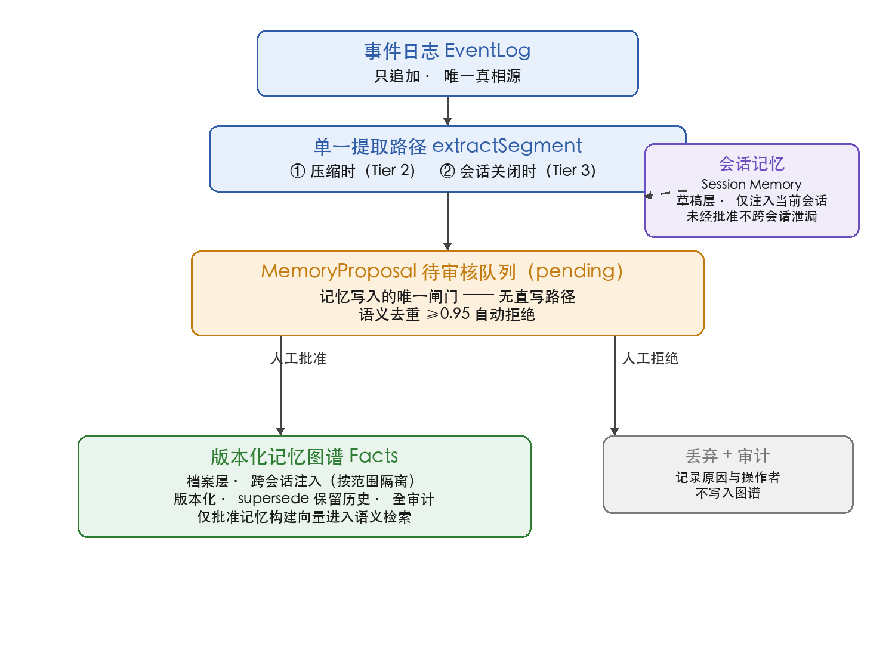
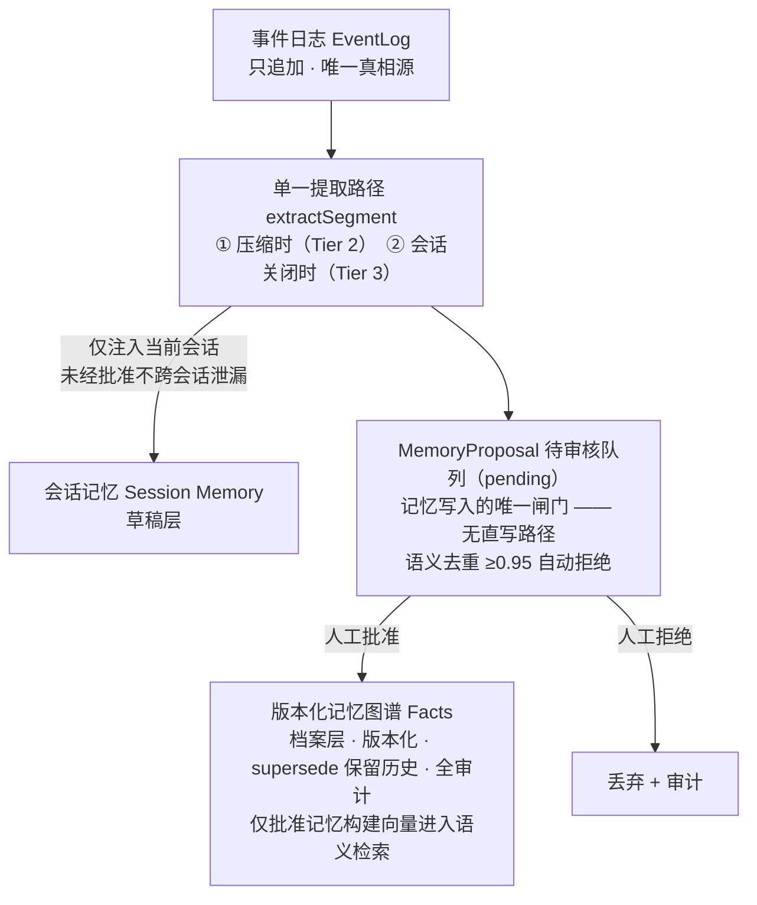
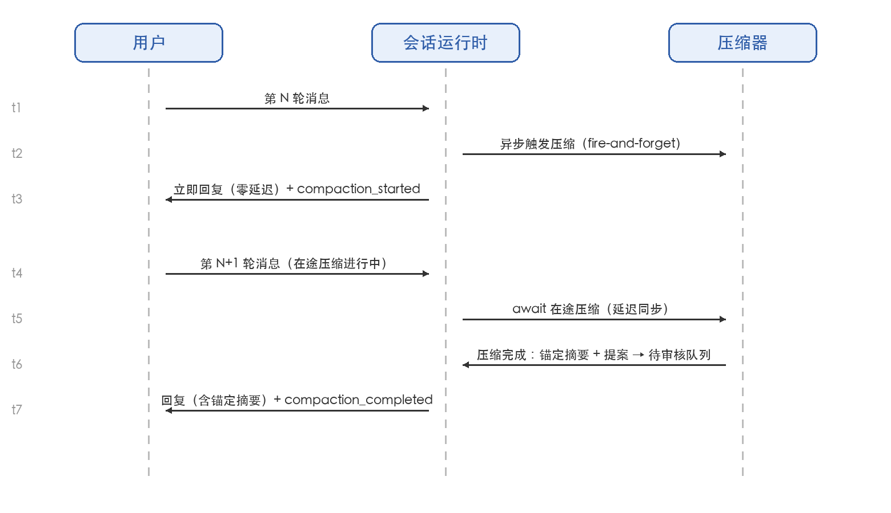
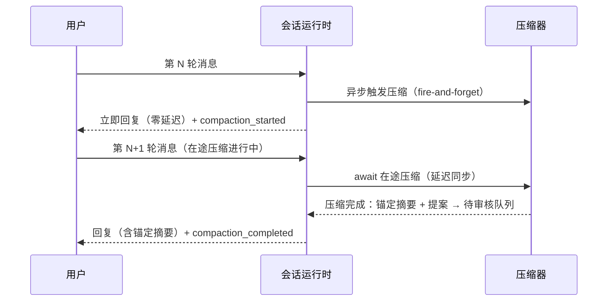
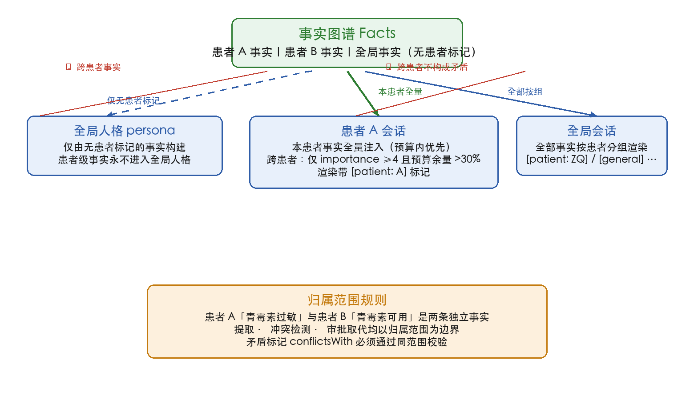
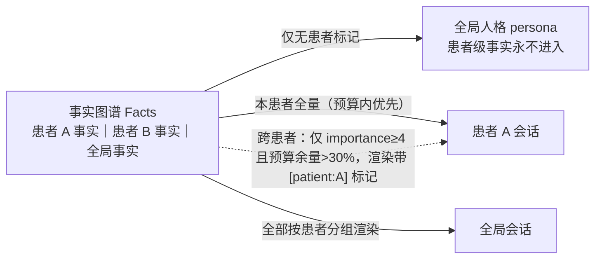
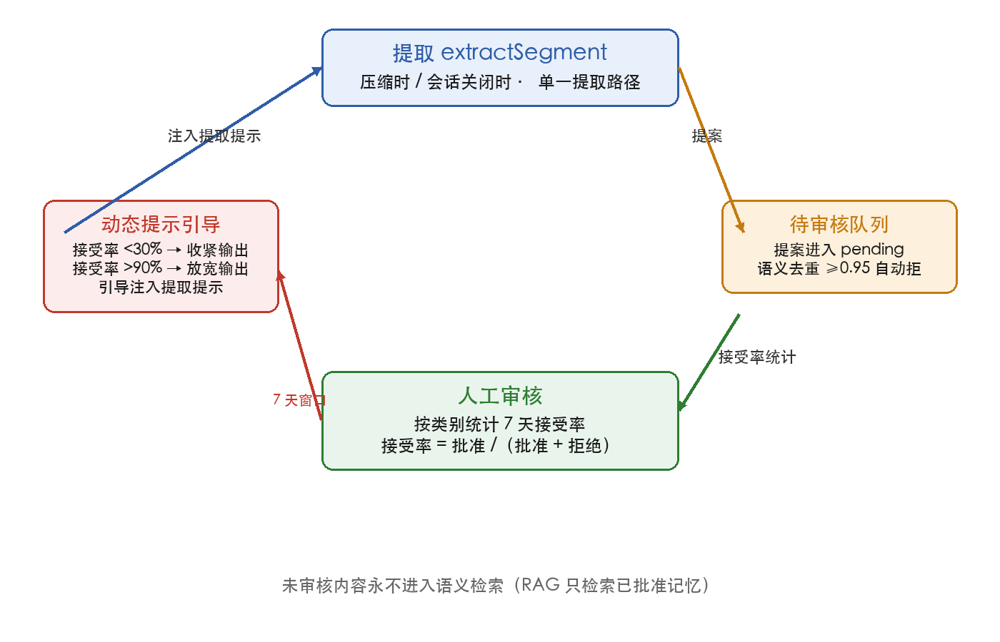
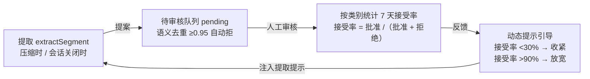
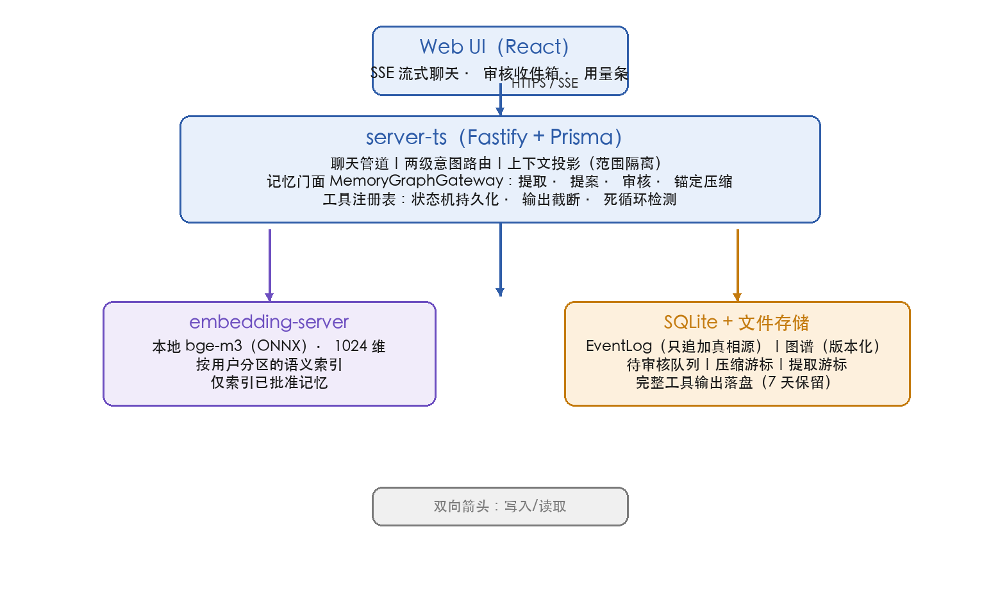
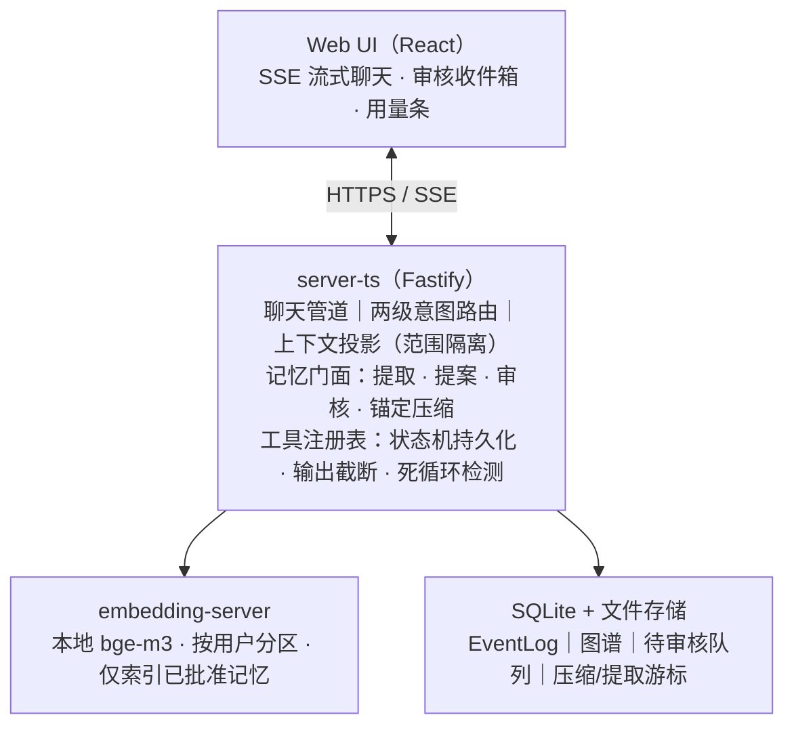

# 发明专利申请草稿（待代理人审阅）

> **性质**：技术交底书 → 申请文件草稿（内部初稿，未提交）
> **申请类型**：中国发明专利（可后续 PCT / US 进入）
> **对应代码**：Heurion（`packages/server-ts`，memory / chat / tools / retrieval）
> **策略**：核心发明单案 —— 以「人工审核式 AI 会话记忆生命周期 + 锚定压缩」为独立权利要求，其余创新以从属权利要求纳入
> **状态**：草稿 v1（2026-08-23），需代理人进行新颖性检索与权利要求布局复核

---

## 一、发明名称

一种基于人工审核闭环与锚定压缩的 AI 会话记忆管理方法、装置及存储介质

（备选：一种用于临床 AI 助手的可审计记忆生命周期管理方法）

## 二、技术领域

本发明涉及人工智能与自然语言处理技术领域，具体涉及一种面向大语言模型（LLM）会话应用的记忆管理方法，尤其涉及会话记忆的提取、审核、版本化存储与长会话上下文压缩。

## 三、背景技术

大语言模型驱动的智能助手（以下简称"AI 助手"）在对话式应用中日益普及。现有 AI 助手的长期记忆方案普遍存在以下问题：

1. **记忆自动写入、错误不可撤销**：现有方案（如基于摘要提取的 Memory 系统）通常在每若干轮对话后由 AI 自动将提取的事实直接写入长期记忆库（facts 直写落库）。一旦 AI 提取错误（如将"患者 A 的过敏史"归入患者 B，或将医生的假设误记为事实），错误立即生效且难以追责与纠正，在临床等高风险场景构成严重可靠性风险。

2. **长会话硬裁剪、早期信息丢失**：当会话超出上下文窗口预算时，现有方案通常对历史消息进行硬裁剪（直接丢弃最旧消息）。被裁剪的早期对话中往往包含关键决策信息（诊断依据、剂量调整、已排除方案等），硬裁剪导致后续轮次丢失连续性，且被裁剪内容无任何人工兜底机制。

3. **提取时机固定、覆盖不完整**：现有方案按固定轮数（如每 5 轮）触发提取，短会话永不提取导致知识流失，长会话重复提取导致冗余，且无游标机制防止多会话交错写入时漏提取。

4. **事实缺乏归属边界（scope）**：现有方案将全部记忆注入同一上下文，跨患者、跨研究的事实混同注入，模型易发生归属混淆（如将患者 A 的事实用于回答患者 B 的问诊）。

5. **矛盾事实无检测、无法更新**：当新信息与既有记忆矛盾时（如"既往青霉素过敏记录有误，现可用"），现有方案无法检测矛盾，旧事实长期滞留误导后续决策。

6. **记忆质量无反馈闭环**：提取器的输出质量（误报率）无法量化，无法驱动提取策略自适应调整。

## 四、发明内容

### 4.1 要解决的技术问题

针对上述背景技术中的至少一个问题，本发明提供一种 AI 会话记忆管理方法，其能够：

- 消除记忆的自动直写路径，使一切持久化记忆写入均须经过人工审核闸门，保证记忆可靠性（问题 1）；
- 在长会话压缩时产出"锚定摘要"而非硬裁剪，并保证压缩结果对后续轮次始终可用（问题 2）；
- 通过单一提取路径与双游标机制，在压缩时与会话关闭时两个触发点增量提取未覆盖段，保证短会话不丢记忆、长会话不重复提取、交错会话不漏提取（问题 3）；
- 使事实携带归属范围标识（scope），上下文投影严格按范围隔离（问题 4）；
- 在同范围内检测矛盾，并以"人工批准即裁决"的方式执行取代（supersede），旧版本保留可审计（问题 5）；
- 基于审核结果统计提取类别接受率，动态调整提取提示（问题 6）。

### 4.2 技术方案

#### 4.2.1 总体架构

本发明的记忆管理方法包括四个收敛于统一门面（MemoryGraphGateway）的能力：

- **读**（readContext）：按归属范围组装会话上下文；
- **提**（extractSegment）：对未覆盖事件段进行批量提取；
- **总**（summarize）：对增量事件段进行锚定摘要与要点总结；
- **写**（applyApproved）：仅对经人工批准的提案执行版本化写入。

其中，**一切记忆写入均须经由"提案 → 待审核队列 → 人工批准"的单一闸门，系统中不存在任何绕过待审核队列的直接写入路径**。

#### 4.2.2 记忆生命周期（独立权利要求核心）

包括以下步骤：

**步骤 S1：事件日志记录。** 会话中的每一轮对话（用户消息、助手回复）以追加方式写入只追加的事件日志（EventLog），事件日志为唯一真相源，各事件具有单调递增的序号（idx）。

**步骤 S2：单一提取路径。** 提取器在且仅在以下两个触发点对未覆盖事件段执行批量提取：
- 触发点①：长会话压缩时，对将被裁剪的事件段执行提取；
- 触发点②：会话关闭时，对自上次提取游标以来的全部未覆盖事件段执行提取（flush）。

提取输入为"未覆盖事件段 + 当前会话的会话记忆（Session Memory）"，输出为：
- 结构化记忆提案（MemoryProposal，至少包含：归属范围、内容、重要性、置信度、提取原因、类别、可选的同范围矛盾标记）；
- 会话记忆更新（episodeUpdate）。

**步骤 S3：待审核队列。** 全部提取结果——无论置信度高低——均进入待审核队列（pending），状态为待处理。在进入队列前执行语义去重：对提案内容做向量化，与同归属范围内已审核记忆计算余弦相似度，相似度不低于预设阈值（如 0.95）时自动判定为重复提案并拒绝，不进入人工审核队列。

**步骤 S4：人工审核。** 由用户对待审核提案逐一或批量执行批准或拒绝：
- 批准：该提案写入版本化记忆图谱（graph），生成新版本节点，并同步为被批准内容构建向量索引（仅被批准记忆进入后续语义检索，未审核内容永不进入检索）；
- 拒绝：记录拒绝原因（可为空）与操作者，进入审计，不写入图谱；
- 任何批准/拒绝操作均写入审计日志。

**步骤 S5：版本化存储与取代。** 记忆图谱中的每个实体具有版本链与状态（current / stale / superseded）。当批准带矛盾标记的提案时，对该标记所指向的同范围内既有事实执行取代（supersede）操作：旧节点标记为 superseded（历史与版本链保留），新事实成为 current，并记录取代关系与审计信息；同时，依赖被取代事实的派生知识（如合成文章）级联标记为失效或同步取代，被取代事实所回答的知识缺口自动重新开放。

**步骤 S6：会话记忆与档案两层存储。** 记忆分为两层：
- 会话记忆（Session Memory / episodes）：每会话一份渐进式摘要（summary + recent 结构），仅注入当前会话，压缩时增量更新同一份，未经批准前不跨会话泄漏；
- 事实档案（Facts）：经批准后的跨会话持久档案。

#### 4.2.3 锚定压缩与延迟同步（独立权利要求核心或第一从属）

**压缩触发：** 当会话历史（系统提示 + 消息 + 工具结果）的估算 token 数超过模型上下文窗口与预留缓冲之差，或真实对话轮数超过轮次窗口、出现被省略轮次时，触发压缩。

**锚定摘要：** 压缩器对将被裁剪的旧事件段执行单次 LLM 调用，同时产出三种产物：
1. **锚定摘要（anchoredSummary）**：结构化 JSON（包含患者状态、已达成决策、治疗方案、关键数值、待办事项、未回答问题等字段），保留本轮之后的连续性；该摘要以"摘要 + 近期原文"结构注入后续轮次，并在下次压缩时更新旧摘要而非重建；
2. **事实提案数组**：按提取规则从旧事件段提取尚未沉淀的事实，进入待审核队列（复用步骤 S2–S4）；
3. **会话记忆更新**：将本段并入会话记忆的渐进摘要，淘汰已过时细节，作为同一次 LLM 调用的输出，避免双重存储。

**压缩游标：** 每会话维护压缩游标（coveredUptoIdx），仅当被覆盖事件段达到最小内容量阈值时执行压缩；压缩成功后游标前进，保证同一段永不重复压缩；压缩失败时不前进游标，留待下次重试。

**延迟同步（delayed-sync）：** 触发压缩的轮次以异步方式触发压缩（不增加该轮回复延迟），并通过进程内"在途压缩"表记录该会话的进行中压缩任务；若后续轮次到达时存在在途压缩任务，则该轮次在回复前等待在途压缩完成，确保锚定摘要对每一轮均可用；压缩开始与完成均向用户界面推送状态事件，压缩完成后重新计算并广播恢复后的上下文预算用量，并将摘要内容写入事件日志使刷新后历史可见。

**提取游标：** 每会话独立维护提取游标（extractedUptoIdx），游标只前进不后退；压缩与会话关闭两触发点推进同一游标，压缩已覆盖段在会话关闭时不再重复提取；游标按会话维度维护，交错会话的写入不会造成某会话事件被永久跳过。

**失败兜底：** 摘要 LLM 调用失败时静默跳过压缩，保留硬裁剪作为兜底行为；待审核队列写入失败仅记录日志，不影响会话运行。

#### 4.2.4 患者隔离的上下文投影（从属特征）

- 全局人格（persona）仅由无归属范围标记的事实构建，患者级事实永不进入全局人格；
- 患者会话注入：本患者事实优先全量注入（预算内）；跨患者事实仅在重要性不低于阈值（如 4）且预算剩余超过比例（如 30%）时少量补充，并以患者标识渲染标记；
- 事实提案的矛盾标记（conflictsWith）必须通过同范围校验：指向非当前状态节点或跨范围事实的标记被丢弃。

#### 4.2.5 提取质量反馈闭环（从属特征）

- 按提取类别统计最近时间窗（如 7 天）内提案的接受率（批准数 /（批准数 + 拒绝数））；
- 接受率低于阈值（如 30%）且样本数足够（≥3）时，向提取提示注入"该类误报较多、请更严格"的引导；
- 接受率高于阈值（如 90%）且样本数足够（≥5）时，注入"该类通常被接受、可更完整输出"的引导。

#### 4.2.6 待审核治理（从属特征）

- 待审核提案超过 7 天未处理时：重要性 ≥ 4 的保持待处理并在收件箱置顶高亮；重要性 ≤ 2 的自动归档（不删除，可恢复）；会话摘要类提案 7 天未审自动归档；
- 待审核队列按归属范围分组展示，支持组内批量批准。

#### 4.2.7 工具调用可观测与防护（从属特征）

- 每次工具调用持久化为状态机（pending → running → completed/error），携带会话内序号，可回放；
- 工具输出超过行数/字节阈值时，按"头部 + 尾部"各半预算采样并在中间插入截断标记，标记中携带完整输出落盘路径；完整输出以 7 天保留期落盘，UTF-8 安全切片保证不截断多字节字符；
- 死循环检测：连续三次相同工具名 + 相同序列化参数的调用在预执行阶段被识别为死循环，向用户界面发出警告，避免继续消耗 token。

#### 4.2.8 两级意图路由（从属特征）

- 第一级规则层：基于关键词与正则模式分类（SQL / 向量检索 / 文件 / 知识库命令 / 混合），毫秒级、零 LLM 成本，覆盖约 80% 查询；
- 第二级 LLM 兜底层：仅当规则层判定为混合意图时调用轻量分类器；
- 安全网：LLM 误分类为"知识库命令"但无法解析为显式命令的，降级为混合意图，自然语言提问永不进入命令处理器；
- 路由结果带 5 分钟 TTL 的有界缓存（上限 500 条），过期优先淘汰。

#### 4.2.9 其他从属特征

- **知识缺口检测**：问题形态消息未被任何已确认事实覆盖时创建知识缺口记录，按 7 天去重；
- **注意力排序**：上下文注入的事实按 score = importance × e^(−0.3 × 天数) 排序取前 N 条；
- **上下文预算透明**：界面展示历史 token 用量百分比，压缩时机可预期；
- **知识合成窗口**：同范围同类别未被使用事实 ≥ 3 条且其中 ≥ 3 条为最近 7 天确认，才触发文章合成；合成结果一律进入待审核队列；
- **双存储原子写**：图谱提交置于末尾，前置写入失败时按快照回滚，保证多存储一致性。

### 4.3 有益效果

1. **可靠性**：记忆写入必须经人工审核，AI 提取错误不产生持久影响；错误记忆可通过批准矛盾提案被取代，全程审计可追溯；未审核内容永不进入语义检索，杜绝 RAG 污染。
2. **连续性**：锚定压缩 + 延迟同步使长会话被压缩后的每轮回复都携带结构化摘要，早期关键信息不丢失；压缩结果同步回显于历史。
3. **完整性**：双触发点单一提取路径 + 双游标，保证短会话关闭时提取全部未覆盖段，长会话分段压缩不重复、不遗漏，交错会话互不干扰。
4. **安全性**：归属范围隔离杜绝跨患者事实混入；同范围矛盾检测 + 批准即取代，临床事实可更新可追责。
5. **自适应性**：提取质量反馈闭环随审核行为动态调整提取提示，误报率自我收敛；待审核队列超期治理避免收件箱堆积。
6. **成本控制**：规则层意图路由零成本覆盖多数查询；工具输出有界化保护上下文预算；死循环预执行检测避免 token 浪费。

## 五、附图说明

下列图 1–图 5 为说明本发明的示意性附图（正式递交时按审查指南要求重绘为黑白线条图）。各图以 Mermaid 源码给出，可在 GitHub / Typora 等支持 Mermaid 的渲染器中查看；PNG 版本位于 `docs/patent/figs/`。

### 图 1：记忆生命周期总体流程图

### 图 2：锚定压缩与延迟同步时序图

### 图 3：范围隔离上下文投影示意图

### 图 4：提取质量反馈闭环示意图

### 图 5：系统架构框图

## 六、具体实施方式

### 6.1 运行环境

本发明的示例实施为临床科研 AI 工作站，后端为 TypeScript + Fastify + SQLite（事件日志、待审核队列、图谱元数据），前端为 React 单页应用，通过 SSE 流式通信；嵌入服务为本地 ONNX 向量模型（bge-m3，1024 维），语义检索按用户分区。

### 6.2 数据模型示例

- 事件日志行：`{ idx, sessionId, eventType, content, metadata, agentId, timestamp }`（只追加）；
- 记忆提案：`{ id, userId, scopeType('patient'|'global'|'study'), patientHash?, studyId?, kind('fact'|'article'|'episode_summary'|'compaction_summary'), content, importance(1-5), confidence, reason, sourceRange, category, conflictsWith, status('pending'|'approved'|'rejected'), rejectedReason?, createdAt, resolvedAt?, resolvedBy?, archivedAt? }`；
- 图谱节点：`{ id, stableId, version, status('current'|'stale'|'superseded'), contentHash, previousVersionId?, patientHash?, studyId?, ... }`；关系边含 `supersedes` 类型；
- 压缩游标表：`{ userId, sessionId, coveredUptoIdx }`（每会话取最大值）；
- 提取游标表：`{ userId, scopeType, patientHash, sessionId, extractedUptoIdx }`（复合主键，per-session）。

### 6.3 关键实施细节

- 提取提示包含：提取规则（聚合同一主题、最多 5 条、重要性门限、自包含表述、排除闲聊/系统状态/通用知识、同范围矛盾标记）、动态质量引导（6.2.5）、同范围已确认事实上下文（最多 10 条，用于去重与矛盾判定）；
- 提取输出解析失败时重试一次并附加修正提示；仍失败则抛出异常，调用方不推进游标，段留待下次重试；
- 压缩提示一次调用产出三产物（锚定摘要 / 事实提案 / 会话记忆更新），仅返回合法 JSON 时接受；
- 双存储（图谱 JSONL + 关系表）写入：先写前置存储并快照，图谱最后提交，失败按快照回滚；
- 延迟同步：进程内 Map 记录 `userId:sessionId → Promise`；存在在途任务时新轮次 await 该 Promise 后再组装回复；
- 消息在流式开始前先落库，客户端断开即中止 LLM 请求，失败轮次不丢失。

### 6.4 测试验证

- 单元：提案生命周期全流转（无直写路径断言）、患者隔离过滤、矛盾 supersede + 审计、去重幂等、游标不回归、质量反馈阈值分支；
- 集成：模拟 60 轮会话 → 压缩触发 → 断言锚定摘要注入、提案进队列、图谱未直接变更；审核通过 → 图谱新版本 + 下次读取可见；
- 隔离测试：患者 A 会话注入事实集合与患者 B 无交集（跨患者仅限 importance ≥ 4 且带标记）。

## 七、权利要求书（草稿）

### 权利要求 1（独立权利要求——方法）

一种 AI 会话记忆管理方法，其特征在于，包括：

以追加方式将会话中的对话事件写入只追加的事件日志，所述事件日志中的事件具有单调递增的序号；

在会话压缩时与会话关闭时两个触发点，对自提取游标以来未被覆盖的事件段执行单一提取路径的批量提取，提取输入包括未覆盖事件段与当前会话的会话记忆，提取输出包括记忆提案与所述会话记忆的更新；

将全部提取结果写入待审核队列，所述待审核队列是记忆写入的唯一闸门，系统中不存在绕过所述待审核队列的直接写入路径；其中，提案进入队列前，对提案内容进行向量化，与同归属范围内已审核记忆计算相似度，相似度不低于预设阈值时自动判定为重复提案并拒绝；

响应于用户对所述待审核队列中提案的批准操作，将该提案写入版本化记忆图谱以生成新版本节点，并仅对被批准的提案构建向量索引以进入语义检索；响应于拒绝操作，记录拒绝信息与操作者并仅写入审计；

其中，所述版本化记忆图谱中的实体具有版本链与状态，状态包括 current、stale 与 superseded；当被批准的提案带有矛盾标记时，对所述标记所指向的同归属范围内的既有事实执行取代操作，将旧节点标记为 superseded、新事实成为 current，并记录取代关系与审计信息。

### 权利要求 2（从属——锚定压缩与延迟同步）

根据权利要求 1 所述的方法，其特征在于，所述会话压缩包括：

当会话历史估算 token 数超过模型上下文窗口与预留缓冲之差、或真实对话轮数超过轮次窗口时触发压缩；

对将被裁剪的事件段执行一次大语言模型调用，同时产出锚定摘要、事实提案数组与会话记忆更新；所述锚定摘要为结构化 JSON，包含患者状态、已达成决策、治疗方案、关键数值、待办事项与未回答问题中的至少一类，以"摘要 + 近期原文"结构注入后续轮次，并在下次压缩时更新旧摘要而非重建；

所述事实提案数组进入所述待审核队列，所述会话记忆更新并入当前会话的会话记忆；

维护每会话的压缩游标，压缩成功后游标前进以避免重复压缩，压缩失败时不前进游标以留待重试。

### 权利要求 3（从属——延迟同步细化）

根据权利要求 2 所述的方法，其特征在于，还包括：触发压缩的轮次以异步方式触发压缩，并在进程内记录该会话的进行中压缩任务；若后续轮次到达时存在进行中压缩任务，则所述后续轮次在回复前等待该压缩任务完成；压缩开始与完成均向用户界面推送状态事件，压缩完成后重新计算并广播恢复后的上下文预算用量。

### 权利要求 4（从属——会话关闭 flush）

根据权利要求 1 所述的方法，其特征在于，所述会话关闭时的提取包括：以压缩游标与提取游标中的较大值为起点，对事件日志中该会话的全部未覆盖事件段执行批量提取；提取成功后提取游标推进至本段实际覆盖的最大事件序号；所述提取游标按会话维度维护且只前进不后退。

### 权利要求 5（从属——会话记忆两形态）

根据权利要求 1 所述的方法，其特征在于，记忆分为会话记忆与事实档案两层：所述会话记忆为每会话一份的渐进式摘要，仅注入当前会话，未经批准前不跨会话泄漏；所述事实档案为经批准后的跨会话持久记忆；两者经同一提取路径产出。

### 权利要求 6（从属——范围隔离）

根据权利要求 1 所述的方法，其特征在于，记忆提案携带归属范围标识，所述归属范围包括患者、全局与研究中的至少一种；上下文投影按归属范围隔离：全局人格仅由无患者归属标记的事实构建；患者会话中本患者事实优先注入，跨患者事实仅在重要性不低于预设阈值且预算剩余超过预设比例时补充注入并附加患者标识；矛盾标记必须通过同范围校验，指向非当前状态节点或跨范围事实的矛盾标记被丢弃。

### 权利要求 7（从属——质量反馈）

根据权利要求 1 所述的方法，其特征在于，还包括：按提取类别统计最近时间窗内提案的接受率；接受率低于第一阈值时，向提取提示注入收紧引导；接受率高于第二阈值且样本数达到预设量时，向提取提示注入放宽引导。

### 权利要求 8（从属——级联传播）

根据权利要求 1 所述的方法，其特征在于，对所述既有事实执行取代操作时，还执行级联传播：依赖被取代事实的合成文章级联标记为失效或被取代；被取代事实所回答的知识缺口自动重新开放。

### 权利要求 9（从属——超期治理）

根据权利要求 1 所述的方法，其特征在于，待审核提案超过预设时长未处理时：重要性不低于阈值的高重要性提案保持待处理并置顶展示；重要性低于阈值且不超过第二阈值的低重要性提案自动归档且可恢复。

### 权利要求 10（从属——工具可观测）

根据权利要求 1 所述的方法，其特征在于，会话中的工具调用被持久化为状态机并携带会话内序号，可回放；工具输出超过阈值时按头部与尾部各半预算采样并插入截断标记，所述截断标记包含完整输出落盘路径，完整输出以预设保留期落盘；连续多次相同工具名与相同序列化参数的调用被识别为死循环并在预执行阶段发出警告。

### 权利要求 11（从属——意图路由）

根据权利要求 1 所述的方法，其特征在于，对用户查询执行两级意图路由：第一级基于关键词与正则模式分类，第二级仅当第一级判定为混合意图时调用大语言模型轻量分类器；当大语言模型分类结果为知识库命令但无法解析为显式命令时，降级为混合意图。

### 权利要求 12（从属——知识缺口）

根据权利要求 1 所述的方法，其特征在于，问题形态且未被任何已确认事实覆盖的消息触发知识缺口记录，同一知识缺口按预设时长去重；所述知识缺口在所述取代操作发生时被自动重新开放。

### 权利要求 13（从属——注意力排序）

根据权利要求 1 所述的方法，其特征在于，注入上下文的事实按 score = importance × e^(−λ × 天数) 排序取前 N 条，其中 λ 为衰减系数，天数表示该事实自最近一次出现以来的天数。

### 权利要求 14（从属——知识合成窗口）

根据权利要求 1 所述的方法，其特征在于，同归属范围同类别的未被使用事实达到第一数量且其中达到第二数量的事实为最近预设时间窗内确认时，才触发知识文章合成，合成结果一律进入待审核队列。

### 权利要求 15（从属——双存储原子写）

根据权利要求 1 所述的方法，其特征在于，写入版本化记忆图谱时采用双存储原子写：先写前置存储并生成快照，图谱最后提交，任一前置写入失败时按快照回滚。

### 权利要求 16（独立权利要求——系统）

一种 AI 会话记忆管理系统，其特征在于，包括：

事件日志模块，用于以追加方式记录会话中的对话事件；

提取模块，用于在会话压缩时与会话关闭时两个触发点，对自提取游标以来未被覆盖的事件段执行单一提取路径的批量提取，输出记忆提案与会话记忆更新；

待审核队列模块，作为记忆写入的唯一闸门，用于接收全部提取结果并执行语义去重，包括：对提案内容向量化并与同归属范围内已审核记忆计算相似度，相似度不低于预设阈值时自动拒绝；

审核处理模块，用于响应人工批准将提案写入版本化记忆图谱并仅对批准的提案构建向量索引，响应人工拒绝记录拒绝信息与操作者并写入审计；其中，批准带矛盾标记的提案时，对该标记指向的同归属范围既有事实执行取代操作，旧节点标记为 superseded、新事实成为 current，并记录取代关系与审计信息；

版本化记忆图谱模块，用于以版本链与状态管理记忆实体，状态包括 current、stale 与 superseded。

### 权利要求 17（独立权利要求——存储介质）

一种计算机可读存储介质，其上存储有计算机程序，所述程序被处理器执行时实现根据权利要求 1 至 15 中任一项所述的 AI 会话记忆管理方法。

## 八、摘要（草稿）

本发明公开一种 AI 会话记忆管理方法、装置及存储介质。方法包括：将对话事件追加写入只追加事件日志；在会话压缩时与会话关闭时两个触发点，经单一提取路径对未覆盖事件段批量提取，产出记忆提案与会话记忆更新；全部提取结果进入作为唯一写入闸门的待审核队列，且入队前对提案执行语义去重；经人工批准后写入版本化记忆图谱并仅对被批准提案构建向量索引，人工拒绝则仅记录审计；批准带矛盾标记的提案时，对同归属范围既有事实执行取代操作，旧节点标记为 superseded 并保留版本链与审计。本发明还通过锚定压缩与延迟同步保证长会话压缩后的连续性，通过归属范围隔离、提取质量反馈闭环、工具调用可观测与两级意图路由实现高可靠性、可审计的自进化会话记忆。

## 九、递交前检查清单（给发明人/代理人）

- [ ] 新颖性检索：现有技术关键词建议 —— "memory proposal human review LLM"、"anchored summarization conversation"、"delayed sync compaction"、"fact supersede versioned memory"、"patient scope isolation clinical AI"、"tool call state machine replay"
- [ ] 需要专利代理机构确认：权利要求 1 中"语义去重"与"矛盾取代"合并进独立权利要求是否过宽/过窄，是否拆分为两个独立权利要求更稳妥
- [ ] 附图需按审查指南格式绘制（图 1–图 5 示意已在第五节列出）
- [ ] 软件方法在 CN 申请通常作为"方法权利要求 + 系统权利要求 + 介质权利要求"组合递交（已列）
- [ ] 背景技术引用需核实现有公开文献（MemGPT、Generative Agents、Mem0、Zep 等公开方案的具体差异需在审查意见答复中说明）
- [ ] 商业考虑：是否同时申请外观/实用新型（不建议，核心为方法）；是否需 PCT 优先权
- [ ] 发明人署名与权属（职务发明/团队）确认
- [ ] 代码仓库是否需在申请前保持私有（公开代码构成现有技术，注意 GitHub 仓库可见性）
